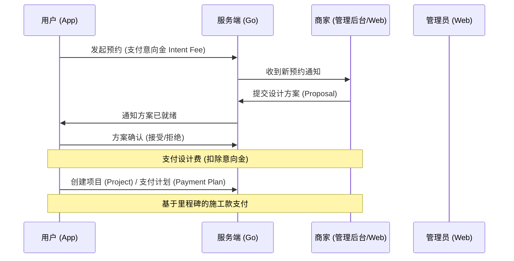

# 业务流程规范 (Business Flow Specification)

> **状态**: 实施阶段 (Phase 1-2 已完成)
> **目标**: 标准化从用户预约到项目完工的端到端流程。

---

## 1. 流程总览 (Overview)

整个业务流程主要分为三个阶段：**预约与进场 (Discovery & Intake)**、**设计方案与提案 (Design & Proposal)**、**项目执行与支付 (Execution & Payment)**。



---

## 2. 详细阶段描述 (Detailed Stages)

### 2.1 预约与进场 (Discovery & Intake)
1. **用户预约**: 用户在移动端选择 `Provider` 并提交 `Booking`。
2. **意向金 (Intent Fee)**:
   - 可通过 `SystemConfig` 进行配置（默认：99 元）。
   - 作为用户诚意金。
   - **技术锚点**: `booking.IntentFee`, `booking.IntentFeePaid`。

### 2.2 设计与方案提案 (Design & Proposal)
1. **提交方案**: 商家上传设计方案草案并设置 `DesignFee` (设计费)。
2. **方案评审**: 用户在移动端查看方案详情。
3. **决策分流**:
   - **接受**: 进入项目创建/合同签署阶段。
   - **拒绝**: 商家可以重新提交方案或取消预约。
4. **技术锚点**: `Proposal` 模型, `proposal_status` (pending/confirmed/rejected)。

### 2.3 项目执行与支付 (Execution & Payment)
1. **账单生成**: 方案确认后，系统自动生成 `Order` (订单)。
2. **抵扣规则**: **意向金 (Intent Fee)** 将在第一笔款项（通常是设计费或首期施工款）中自动扣除。
3. **里程碑支付**: 施工费用遵循分阶段支付计划（例如：开工款、中期款、尾款）。
4. **文件访问控制**: 所有的附件（如设计蓝图、施工合同）只有在相关 `Order` 标记为 `paid` (已支付) 后才允许下载。
5. **技术锚点**: `Order.Type` (design/construction), `Order.Status` (pending/paid), `EscrowAccount`。

---

## 3. 核心数据实体 (Data Entities)

| 实体 | 描述 | 关键字段 (Key Fields) |
| :--- | :--- | :--- |
| `Booking` | 初始服务请求 | `ProviderID`, `IntentFee`, `Status` |
| `Proposal` | 商家提交的设计/报价方案 | `BookingID`, `DesignFee`, `Attachments` |
| `Project` | 激活的装修项目 | `OwnerID`, `ProviderID`, `ContractPrice` |
| `Order` | 资金交易单元 | `Amount`, `Type`, `IsDeducted` |
| `Milestone`| 项目进度跟踪 | `StepNumber`, `Title`, `IsCompleted` |

---

## 4. 状态流转 (State Transitions)

### 预约状态 (Booking Status)
- `pending`: 等待商家接单。
- `confirmed`: 商家已确认，等待方案提交。
- `in_progress`: 方案已提交或项目执行中。
- `completed`: 项目已结束。

### 订单状态 (Order Status)
- `pending_payment`: 账单已生成，等待支付。
- `paid`: 支付成功。
- `refunded`: 发生纠纷或取消后的退款。

---

## 5. 异常与容错流程 (Exception Handling)

### 5.1 方案拒绝与重试
- **拒绝场景**: 用户对设计方案不满意。
- **重试机制**:
  1. 用户选择 "拒绝" 并填写理由。
  2. 商家收到通知，进入 "待修改" 状态。
  3. 商家重新上传方案（版本号 +1）。
  4. 若连续拒绝 3 次，系统自动介入或允许用户无责取消。

### 5.2 超时取消
- **商家超时**: 支付意向金后 48 小时无响应，自动全额退款。
- **用户超时**: 方案提交后 7 天未确认，自动提醒；14 天未确认，视为自动放弃（意向金不退）。

---

## 6. 通知机制 (Notifications)

| 触发节点 | 接收方 | 渠道 | 消息内容示例 |
| :--- | :--- | :--- | :--- |
| **支付意向金** | 商家 | 短信 + App | "您有新的预约请求，请在 48 小时内接单" |
| **商家接单** | 用户 | App 推送 | "设计师已受理您的预约，正在准备方案" |
| **方案提交** | 用户 | 短信 + App | "您的设计方案已生成，请前往查看" |
| **账单生成** | 用户 | App 推送 | "新阶段账单已生成，请按时支付" |

---

## 7. 退款与售后 (Refund & After-Sales)

### 7.1 意向金退还
- **可退场景**: 商家拒单、商家超时未接单、首次方案严重不符（需申诉）。
- **不可退场景**: 用户因为非质量原因主动取消、多次方案修改后仍不满意（具体依合同条款）。

### 7.2 质保与评价
- **评价入口**: 项目状态更新为 `completed` 后开放。
- **评价维度**: 服务态度、设计还原度、施工质量。
- **质保期**: 施工结束日起算（例如 2 年水电质保），期间用户可发起 "售后申请"。

---

## 8. 合同与签署 (Contract Signing)

1. **生成时机**: 用户确认设计方案，且支付设计费/首期款前。
2. **电子签约**:
   - 系统基于模板自动生成 PDF。
   - 用户及商家进行电子签名/实名认证。
3. **存证**: 签署后的合同文件存入 `Escrow` 系统，且不可篡改。

---

## 9. 安全与约束 (Security & Constraints)
- **权限控制 (RBAC)**: 用户仅能查看名下的项目；商家仅能查看分配给自己的预约。
- **附件保护**: 后端在提供二进制文件流下载前，会校验对应 `Order.Status == 'paid'`。
- **并发处理**: 在支付过程中对 `EscrowAccount` 使用 `SELECT FOR UPDATE` 锁定行，防止重复扣款。

---

## 10. 验证方式 (How to Verify)

### 10.1 后端单元测试
- **业务逻辑**: `internal/service/order_service_test.go`
- **RBAC 权限**: `internal/middleware/middleware_test.go`

### 10.2 端到端自动化测试 (E2E)
为确保全链路业务及通知闭环，提供基于 **Playwright** 的自动化脚本。

**覆盖场景**:
- 用户预约 & 意向金支付 (通知商家/管理员)
- 商家提交方案 (通知用户)
- 用户确认方案 (通知商家/生成订单)
- 订单支付 (通知商家)

**运行命令**:
```powershell
npx playwright install chromium
npx playwright test tests/e2e/notification.test.ts
```

---
