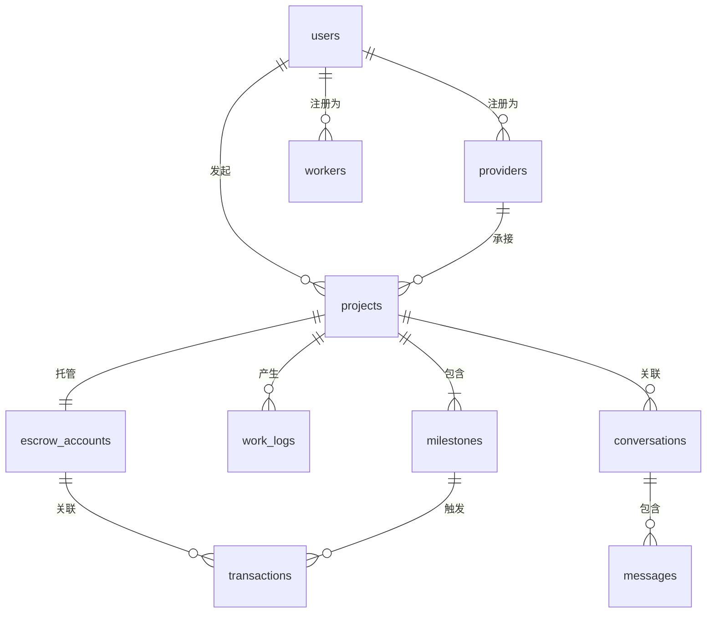

# 装修设计一体化平台 - 数据库设计文档

> **文档版本**: v1.0  
> **创建日期**: 2024年12月  
> **数据库**: PostgreSQL 15+

---

## 1. 设计原则

- **规范化**: 遵循第三范式，减少数据冗余
- **扩展性**: 预留扩展字段，支持业务演进
- **性能**: 合理索引，分区策略
- **安全**: 敏感数据加密存储

---

## 2. 数据库架构

```
┌─────────────────────────────────────────────────────┐
│                    主库 (PostgreSQL)                 │
├──────────────┬──────────────┬───────────────────────┤
│   用户域      │   项目域      │    交易域             │
│  users       │  projects    │   escrow_accounts     │
│  user_auth   │  milestones  │   transactions        │
│  providers   │  work_logs   │   payments            │
│  workers     │  contracts   │   invoices            │
└──────────────┴──────────────┴───────────────────────┘
```

---

## 3. 核心表设计

### 3.1 用户域

#### users (用户表)

| 字段 | 类型 | 约束 | 说明 |
|------|------|------|------|
| id | BIGSERIAL | PK | 用户ID |
| phone | VARCHAR(20) | UNIQUE, NOT NULL | 手机号 |
| nickname | VARCHAR(50) | | 昵称 |
| avatar_url | VARCHAR(500) | | 头像URL |
| user_type | SMALLINT | NOT NULL | 1业主 2服务商 3工人 |
| status | SMALLINT | DEFAULT 1 | 0禁用 1正常 |
| created_at | TIMESTAMP | DEFAULT NOW() | 创建时间 |
| updated_at | TIMESTAMP | | 更新时间 |

```sql
CREATE INDEX idx_users_phone ON users(phone);
CREATE INDEX idx_users_type ON users(user_type);
```

#### providers (服务商表)

| 字段 | 类型 | 约束 | 说明 |
|------|------|------|------|
| id | BIGSERIAL | PK | 服务商ID |
| user_id | BIGINT | FK -> users | 关联用户 |
| provider_type | SMALLINT | NOT NULL | 1设计师 2公司 3工长 |
| company_name | VARCHAR(100) | | 公司名称 |
| license_no | VARCHAR(50) | | 营业执照号 |
| service_area | GEOMETRY | | 服务范围(GIS) |
| rating | DECIMAL(2,1) | DEFAULT 0 | 评分 |
| restore_rate | DECIMAL(5,2) | | 还原度 |
| budget_control | DECIMAL(5,2) | | 预算控制力 |
| completed_count | INT | DEFAULT 0 | 完成订单数 |
| verified | BOOLEAN | DEFAULT FALSE | 资质认证 |
| created_at | TIMESTAMP | DEFAULT NOW() | 创建时间 |

```sql
CREATE INDEX idx_provider_type ON providers(provider_type);
CREATE INDEX idx_provider_area ON providers USING GIST(service_area);
CREATE INDEX idx_provider_rating ON providers(rating DESC);
```

#### workers (工人表)

| 字段 | 类型 | 约束 | 说明 |
|------|------|------|------|
| id | BIGSERIAL | PK | 工人ID |
| user_id | BIGINT | FK -> users | 关联用户 |
| skill_type | VARCHAR(50) | NOT NULL | 工种 |
| origin | VARCHAR(50) | | 籍贯 |
| cert_water | BOOLEAN | DEFAULT FALSE | 水电证 |
| cert_height | BOOLEAN | DEFAULT FALSE | 高空证 |
| hourly_rate | DECIMAL(10,2) | | 时薪 |
| insured | BOOLEAN | DEFAULT FALSE | 已投保 |
| location | GEOMETRY(POINT) | | 当前位置 |
| available | BOOLEAN | DEFAULT TRUE | 可接单 |

---

### 3.2 项目域

#### projects (项目表)

| 字段 | 类型 | 约束 | 说明 |
|------|------|------|------|
| id | BIGSERIAL | PK | 项目ID |
| owner_id | BIGINT | FK -> users | 业主ID |
| provider_id | BIGINT | FK -> providers | 服务商ID |
| name | VARCHAR(100) | NOT NULL | 项目名称 |
| address | VARCHAR(200) | NOT NULL | 地址 |
| location | GEOMETRY(POINT) | | 坐标 |
| area | DECIMAL(10,2) | | 面积(㎡) |
| budget | DECIMAL(12,2) | | 预算 |
| status | SMALLINT | DEFAULT 0 | 状态 |
| current_phase | VARCHAR(50) | | 当前阶段 |
| start_date | DATE | | 开工日期 |
| expected_end | DATE | | 预计完工 |
| actual_end | DATE | | 实际完工 |
| created_at | TIMESTAMP | DEFAULT NOW() | 创建时间 |

**项目状态枚举**:
- 0: 待签约
- 1: 已签约
- 2: 施工中
- 3: 已完工
- 4: 已结算
- -1: 已取消

#### milestones (验收节点表)

| 字段 | 类型 | 约束 | 说明 |
|------|------|------|------|
| id | BIGSERIAL | PK | 节点ID |
| project_id | BIGINT | FK -> projects | 项目ID |
| name | VARCHAR(50) | NOT NULL | 节点名称 |
| seq | SMALLINT | NOT NULL | 顺序 |
| amount | DECIMAL(12,2) | NOT NULL | 金额 |
| percentage | DECIMAL(5,2) | | 占比 |
| status | SMALLINT | DEFAULT 0 | 状态 |
| criteria | TEXT | | 验收标准 |
| submitted_at | TIMESTAMP | | 提交验收时间 |
| accepted_at | TIMESTAMP | | 通过时间 |
| paid_at | TIMESTAMP | | 支付时间 |

**节点状态**: 0待施工 1施工中 2待验收 3已通过 4已支付

#### work_logs (施工日志表)

| 字段 | 类型 | 约束 | 说明 |
|------|------|------|------|
| id | BIGSERIAL | PK | 日志ID |
| project_id | BIGINT | FK -> projects | 项目ID |
| worker_id | BIGINT | FK -> workers | 工人ID |
| log_date | DATE | NOT NULL | 日志日期 |
| description | TEXT | | 描述 |
| photos | JSONB | | 照片URL数组 |
| ai_analysis | JSONB | | AI分析结果 |
| is_compliant | BOOLEAN | | 是否合规 |
| issues | JSONB | | 问题列表 |
| created_at | TIMESTAMP | DEFAULT NOW() | 创建时间 |

```sql
CREATE INDEX idx_log_project ON work_logs(project_id);
CREATE INDEX idx_log_date ON work_logs(log_date);
```

---

### 3.3 交易域

#### escrow_accounts (托管账户表)

| 字段 | 类型 | 约束 | 说明 |
|------|------|------|------|
| id | BIGSERIAL | PK | 账户ID |
| project_id | BIGINT | FK -> projects, UNIQUE | 项目ID |
| total_amount | DECIMAL(12,2) | NOT NULL | 托管总额 |
| frozen_amount | DECIMAL(12,2) | DEFAULT 0 | 冻结金额 |
| released_amount | DECIMAL(12,2) | DEFAULT 0 | 已释放金额 |
| status | SMALLINT | DEFAULT 1 | 状态 |
| created_at | TIMESTAMP | DEFAULT NOW() | 创建时间 |

#### transactions (交易记录表)

| 字段 | 类型 | 约束 | 说明 |
|------|------|------|------|
| id | BIGSERIAL | PK | 交易ID |
| escrow_id | BIGINT | FK -> escrow_accounts | 托管账户 |
| milestone_id | BIGINT | FK -> milestones | 关联节点 |
| type | VARCHAR(20) | NOT NULL | 交易类型 |
| amount | DECIMAL(12,2) | NOT NULL | 金额 |
| from_user | BIGINT | FK -> users | 付款方 |
| to_user | BIGINT | FK -> users | 收款方 |
| status | SMALLINT | DEFAULT 0 | 状态 |
| created_at | TIMESTAMP | DEFAULT NOW() | 创建时间 |
| completed_at | TIMESTAMP | | 完成时间 |

**交易类型**: deposit(存入), release(释放), refund(退款), withdraw(提现)

---

### 3.4 消息域

#### conversations (会话表)

| 字段 | 类型 | 约束 | 说明 |
|------|------|------|------|
| id | BIGSERIAL | PK | 会话ID |
| project_id | BIGINT | FK -> projects | 关联项目 |
| participant_ids | BIGINT[] | NOT NULL | 参与者ID数组 |
| last_message_id | BIGINT | | 最后消息ID |
| last_active_at | TIMESTAMP | | 最后活跃 |
| created_at | TIMESTAMP | DEFAULT NOW() | 创建时间 |

#### messages (消息表)

| 字段 | 类型 | 约束 | 说明 |
|------|------|------|------|
| id | BIGSERIAL | PK | 消息ID |
| conversation_id | BIGINT | FK -> conversations | 会话ID |
| sender_id | BIGINT | FK -> users | 发送者 |
| msg_type | VARCHAR(20) | NOT NULL | 类型 |
| content | TEXT | | 内容 |
| media_url | VARCHAR(500) | | 媒体URL |
| created_at | TIMESTAMP | DEFAULT NOW() | 创建时间 |

---

## 4. 索引策略

### 4.1 主要索引

| 表 | 索引 | 类型 | 说明 |
|---|------|------|------|
| users | phone | B-Tree | 登录查询 |
| providers | service_area | GiST | 地理围栏查询 |
| projects | (owner_id, status) | B-Tree | 用户项目列表 |
| work_logs | (project_id, log_date) | B-Tree | 日志时间线 |

### 4.2 分区策略

```sql
-- 交易记录按月分区
CREATE TABLE transactions (
  ...
) PARTITION BY RANGE (created_at);

CREATE TABLE transactions_2024_01 
PARTITION OF transactions
FOR VALUES FROM ('2024-01-01') TO ('2024-02-01');
```

---

## 5. 数据安全

### 5.1 加密字段

| 表 | 字段 | 加密方式 |
|---|------|---------|
| users | phone | AES-256 |
| users | id_card | AES-256 |
| providers | license_no | AES-256 |

### 5.2 审计日志

```sql
CREATE TABLE audit_logs (
  id BIGSERIAL PRIMARY KEY,
  table_name VARCHAR(50),
  record_id BIGINT,
  action VARCHAR(20),
  old_values JSONB,
  new_values JSONB,
  operator_id BIGINT,
  operated_at TIMESTAMP DEFAULT NOW()
);
```

---

## 6. ER 图



---

## 附录

### A. 枚举值表
- 用户类型: 1业主 2服务商 3工人 4管理员
- 服务商类型: 1设计师 2公司 3工长
- 项目状态: 0待签约 1已签约 2施工中 3已完工 4已结算 -1已取消
- 节点状态: 0待施工 1施工中 2待验收 3已通过 4已支付

### B. 修订记录
| 版本 | 日期 | 修订 |
|-----|------|-----|
| v1.0 | 2024-12 | 初稿 |
