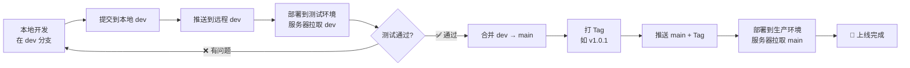

# Git 分支管理与工作流程

**版本**: v1.0  
**更新时间**: 2026-01-01

---

## 📋 分支策略总览

本项目采用**双分支工作流**，确保开发与生产环境隔离，降低上线风险。

| 分支名 | 用途 | 保护级别 | 谁可以推送 |
|--------|------|----------|------------|
| `main` | **生产环境分支**<br>部署到线上服务器的代码 | 🔒 高 | 仅接受来自 `dev` 的合并 |
| `dev`  | **开发分支**<br>日常开发、测试、调试 | 🔓 低 | 所有开发者 |

---

## 🔄 完整工作流程



---

## 📝 日常开发操作

### 1. 开始新功能开发

```powershell
# 确保在 dev 分支
git checkout dev

# 拉取最新代码（避免冲突）
git pull origin dev

# 开始编写代码...
```

### 2. 提交代码到开发分支

```powershell
# 查看修改内容
git status

# 添加文件
git add .

# 提交（使用规范的 commit message）
git commit -m "feat: 添加用户头像上传功能"

# 推送到远程 dev 分支
git push origin dev
```

**Commit Message 规范**:
- `feat:` 新功能
- `fix:` 修复 Bug
- `docs:` 文档更新
- `refactor:` 重构代码
- `style:` 代码格式调整
- `test:` 测试相关

---

## 🚀 测试环境部署

测试环境使用 `dev` 分支，端口为 `:8888`。

```bash
# 登录测试服务器
ssh user@your-server-ip

# 进入测试环境目录
cd /www/home_decoration_staging

# 拉取最新 dev 分支代码
git checkout dev
git pull origin dev

# 部署（使用测试环境脚本）
./scripts/deploy_staging.sh

# 验证
curl http://localhost:8888/api/health
```

**访问测试环境**:
- Admin 后台: `http://服务器IP:8888/admin/`
- Mobile Web: `http://服务器IP:8888/`
- API 接口: `http://服务器IP:8888/api/`

---

## 🎯 生产环境发布

### 完整发布流程 (仅限 main 分支)

#### 第一步：本地合并 dev → main

```powershell
# 1. 切换到 main 分支
git checkout main

# 2. 拉取最新 main 代码（防止冲突）
git pull origin main

# 3. 合并 dev 分支到 main
git merge dev

# 4. 解决冲突（如果有）
# 手动编辑冲突文件，然后：
git add .
git commit -m "merge: 合并 dev 到 main，发布 v1.0.1"
```

#### 第二步：打 Tag（版本标记）

```powershell
# 打标签（版本号规则：v主版本.次版本.补丁）
git tag v1.0.1

# 推送 main 分支和 Tag
git push origin main
git push origin v1.0.1
```

#### 第三步：服务器部署

```bash
# 登录生产服务器
ssh user@your-server-ip

# 进入生产环境目录
cd /www/home_decoration_prod

# 切换到 main 分支（确保不会误用 dev）
git checkout main
git pull origin main

# 切换到指定 Tag（最安全的方式）
git checkout v1.0.1

# 执行部署脚本
./scripts/deploy_prod.sh

# 验证
docker-compose -f deploy/docker-compose.prod.yml ps
docker-compose -f deploy/docker-compose.prod.yml logs -f --tail=100

# 健康检查
curl http://localhost/api/health
```

#### 第四步：切换回 dev 继续开发

```powershell
# 本地切换回 dev 分支
git checkout dev

# 同步 main 的变更到 dev（可选，保持 dev 与 main 一致）
git merge main
git push origin dev
```

---

## 🔧 常见场景

### 场景 1：紧急修复线上 Bug (Hotfix)

```powershell
# 1. 从 main 分支创建修复分支
git checkout main
git checkout -b hotfix/fix-payment-error

# 2. 修复代码并提交
git add .
git commit -m "fix: 修复支付接口报错"

# 3. 合并到 main
git checkout main
git merge hotfix/fix-payment-error

# 4. 打紧急版本 Tag
git tag v1.0.2
git push origin main
git push origin v1.0.2

# 5. 同步到 dev（防止下次发版丢失修复）
git checkout dev
git merge main
git push origin dev

# 6. 删除临时分支
git branch -d hotfix/fix-payment-error
```

### 场景 2：回滚到上一个版本

```bash
# 服务器上操作
cd /www/home_decoration_prod

# 查看历史 Tag
git tag -l

# 切换到上一个稳定版本
git checkout v1.0.0

# 重新部署
./scripts/deploy_prod.sh
```

### 场景 3：查看分支差异

```powershell
# 查看 dev 比 main 多了哪些提交
git log main..dev --oneline

# 查看具体文件差异
git diff main..dev
```

---

## ⚠️ 重要规则

> [!CAUTION]
> **禁止操作**：
> 1. ❌ 禁止直接在 `main` 分支开发（除非紧急 Hotfix）
> 2. ❌ 禁止未经测试就合并到 `main`
> 3. ❌ 禁止删除 `main` 或 `dev` 分支
> 4. ❌ 禁止强制推送 `git push -f`（除非你完全知道后果）

> [!IMPORTANT]
> **最佳实践**：
> 1. ✅ 每天开始工作前先 `git pull origin dev`
> 2. ✅ 每次发布前在测试环境验证
> 3. ✅ 每次合并到 `main` 都打 Tag
> 4. ✅ 定期清理本地无用分支 `git branch -d <branch-name>`

---

## 📞 快速命令参考

```powershell
# === 日常开发 ===
git checkout dev                    # 切换到开发分支
git pull origin dev                 # 拉取最新代码
git add .                           # 添加所有修改
git commit -m "feat: 描述"          # 提交
git push origin dev                 # 推送

# === 发布流程 ===
git checkout main                   # 切换到主分支
git merge dev                       # 合并开发分支
git tag v1.0.x                      # 打标签
git push origin main --tags         # 推送主分支和标签

# === 查看状态 ===
git status                          # 当前状态
git branch -a                       # 查看所有分支
git log --oneline -10               # 最近 10 次提交
git diff main..dev                  # 比较分支差异

# === 紧急回滚 ===
git checkout v1.0.0                 # 切换到指定版本
```

---

## 🔗 相关文档

- [DEPLOYMENT_GUIDE_ZH.md](./DEPLOYMENT_GUIDE_ZH.md) - 完整部署指南
- [版本发布与回滚指南.md](./版本发布与回滚指南.md) - 版本管理详解
- [全栈部署指南.md](./全栈部署指南.md) - 移动端打包说明

---

*本文档持续更新，如有疑问请参考相关文档或联系项目维护者。*
