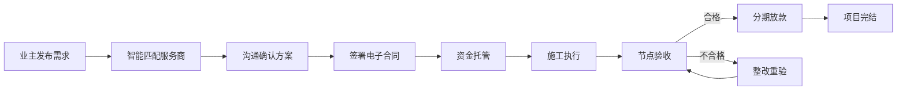
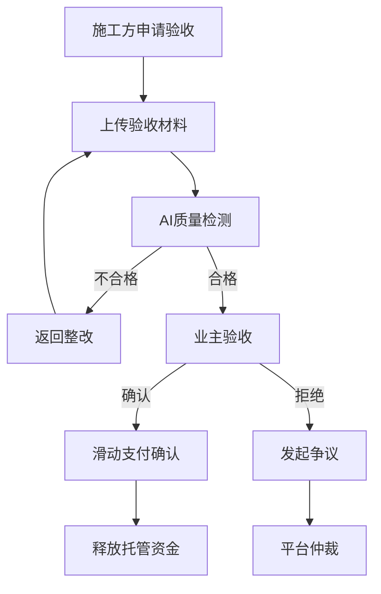

# 装修设计一体化平台 - 产品需求文档 (PRD)

> **文档版本**: v1.0  
> **创建日期**: 2024年12月  
> **文档状态**: 初稿

---

## 1. 产品概述

### 1.1 产品愿景
打造装修界的"信任操作系统"，通过技术手段彻底解决装修行业的信任死结。

### 1.2 核心隐喻
- **前端体验**：像美团找餐厅一样找设计师，像看外卖骑手位置一样看工地进度
- **后端逻辑**：像支付宝担保交易一样，节点验收合格才放款

### 1.3 核心价值
**去黑箱化** - 通过 LBS（位置服务）、AI 视觉验证和资金托管，建立工业级的信任标准。

### 1.4 目标用户

| 用户角色 | 描述 | 核心诉求 |
|---------|------|---------|
| 业主 | 有装修需求的房产所有者 | 透明、可控、省心 |
| 设计师 | 独立设计师或设计工作室 | 获客、展示作品、高效协作 |
| 工长/项目经理 | 施工团队负责人 | 获取订单、智能协作、高效交付 |
| 一线工人 | 泥瓦匠、油漆工等产业工人 | 便捷接单、准时收款 |
| 装修公司 | 全包/半包服务商 | 获客转化、项目管理 |
| 建材商/门店 | 建材销售方 | 线上引流、线下成交 |

---

## 2. 产品架构

### 2.1 终端矩阵

```
┌─────────────────────────────────────────────────────────────────────┐
│                        装修设计一体化平台                               │
├──────────────┬──────────────┬──────────────┬───────────────────────┤
│   业主端 APP  │   专业端 APP  │   工人端 APP  │    Web 管理后台        │
│  (Client)    │    (Pro)     │   (Worker)   │     (Admin)          │
├──────────────┼──────────────┼──────────────┼───────────────────────┤
│ • 找设计师    │ • 线索雷达    │ • 接活        │ • 运营中台            │
│ • 找装修公司  │ • BIM协同     │ • 打卡        │ • 资金风控            │
│ • 找工长     │ • AI施工日志  │ • 领钱        │ • 商户审核            │
│ • 逛建材店   │ • 质量预警    │              │ • 仲裁法庭            │
│ • AI设计    │              │              │                      │
│ • 我的工地   │              │              │                      │
└──────────────┴──────────────┴──────────────┴───────────────────────┘
```

### 2.2 业务流程图



---

## 3. 功能需求详述

### 3.1 业主端 APP (Client Side)

#### 3.1.1 首页架构

**顶部导航栏**
| 元素 | 功能描述 |
|------|---------|
| LBS定位 | 显示当前位置，如"杭州·西溪诚园"，自动推荐附近5km优质服务商 |
| 全局搜索 | 支持搜索设计风格、服务类型、品牌等，如"北欧风设计师"、"水电维修" |

**金刚区（核心业务入口）**
| 入口 | 功能 | 优先级 |
|------|------|-------|
| 🎨 找设计师 | 个人设计师列表 | P0 |
| 🏢 装修公司 | 装修公司/工作室列表 | P0 |
| 👷 找工长/工人 | 工长及施工团队列表 | P0 |
| 🏪 逛建材店 | O2O建材零售 | P1 |
| 🤖 AI免费设计 | 上传户型图10秒出3D方案（引流工具） | P1 |

**我的工地动态胶囊**
- **UI样式**: 悬浮于底部的动态卡片（类似外卖送达倒计时）
- **显示内容**: 当前施工节点、进度天数、状态指示（🟢正常/🟡滞后/🔴异常）
- **交互**: 点击展开查看今日施工直播/日志

#### 3.1.2 找设计师模块

**列表页排序算法**
```
综合得分 = 落地还原度 × 40% + 预算控制力 × 30% + 服务分 × 20% + 距离权重 × 10%
```

| 指标 | 权重 | 计算方式 |
|------|------|---------|
| 落地还原度 | 40% | AI比对"效果图 vs 完工照"像素相似度 |
| 预算控制力 | 30% | (决算价-预算价)/预算价，偏差越小分数越高 |
| 服务分 | 20% | 响应速度 + 用户真实评价 |
| 距离优先 | 10% | 同城/同小区优先展示 |

**详情页功能**
- VR全景案例展示
- 设计师作品集
- "避坑"承诺书展示（无恶意增项电子承诺）
- 在线咨询/预约量房
- 历史项目评价

#### 3.1.3 装修公司模块

**透明报价体系**
- 套餐类型展示（全包/半包/设计+施工）
- 展开式BOM物料清单（瓷砖品牌、乳胶漆型号、施工工艺标准）
- 价格区间透明化

**工地地图功能**
- 显示该公司在用户附近3km内的在建工地
- 一键预约参观功能
- 工地实时状态展示

#### 3.1.4 找工长模块（滴滴打工模式）

**去中介化价值**: 直接连接工长，去除装修公司30%管理费

**信用护照体系**
| 认证项 | 说明 |
|-------|------|
| 籍贯标签 | "安徽工长"、"江苏木工"等行业认可地域标签 |
| 技能认证 | 水电工证、高空作业证（OCR自动核验） |
| 保险标识 | 平台赠送工程综合险及工人意外险 |
| 历史评价 | 过往项目业主真实评价 |

#### 3.1.5 建材商城模块（O2O）

**LBS地图模式**
- 周围5km内建材城、品牌专卖店展示
- 距离、评分、促销信息

**AR试衣间**
- 选中地板/窗帘等产品
- 开启摄像头对准房间
- AR实时覆盖预览效果

**到店核销**
- 线上领取联名优惠券
- 线下扫码核销
- 平台追踪交易，防止跳单

#### 3.1.6 资金托管与验收系统

**资金泳道图**
将装修款切分为4-5个节点：
1. 开工款 (20%)
2. 水电款 (25%)
3. 泥木款 (25%)
4. 油漆款 (15%)
5. 竣工款 (15%)

**验收流程**


**滑动支付交互**
- 验收合格后，用户需从左向右滑动"确认支付"滑块
- 增强用户对资金的掌控感
- 防止误触

---

### 3.2 专业端 APP (Pro Side)

#### 3.2.1 工作台

**线索雷达**
- 基于LBS推送附近量房需求
- 显示距离、户型、预算范围
- 一键抢单功能

**示例推送**
> "距离您1.5km有新订单：西溪诚园 120㎡，预算50万，[立即抢单]"

#### 3.2.2 BIM协同查看器

**轻量化CAD/BIM引擎**
- 支持常见设计图纸格式
- 多人协同标注
- 版本管理

**AR透视眼**
- 工长现场打开摄像头
- 屏幕叠加显示墙体内水电管线走向（基于BIM数据）
- 避免打孔爆管事故

#### 3.2.3 智能交付系统

**AI施工日志**
| 功能 | 说明 |
|------|------|
| 智能识别 | 上传照片，AI自动识别施工内容 |
| 自动生成 | 根据识别结果自动生成日报文字 |
| 质量预警 | 检测不合规施工并在照片上标记红框 |
| 整改追踪 | 不整改无法发起验收申请 |

**预警规则示例**
- 防水涂刷高度不足
- 电线未套管
- 水管未固定
- 墙体开槽过深

---

### 3.3 工人端 APP (Worker Side)

#### 3.3.1 设计原则
- 大字号、高对比度
- 零学习成本
- 仅保留核心功能

#### 3.3.2 核心功能（仅3个按钮）

**接活 (Get Jobs)**
- 卡片式任务展示："贴砖50平米，单价40元/平，距离500米"
- 硕大的"接单"按钮
- 基于GPS推荐附近任务

**打卡 (Check-in)**
- GPS围栏检测到达工地
- 按钮变绿可打卡
- 记录工时作为工资结算依据

**领钱 (Get Paid)**
- 完工拍照上传
- 工长确认
- 工资日结/周结（秒到账微信/支付宝）

---

### 3.4 Web管理后台 (Admin Portal)

#### 3.4.1 运营中台

**全景看板 (God View)**
- GIS地图展示全城在建工地
- 红绿灯预警系统

| 状态 | 含义 |
|------|------|
| 🟢 绿色 | 进度正常 |
| 🟡 黄色 | 工期滞后>3天，或48小时无日志更新 |
| 🔴 红色 | 资金纠纷、违规增项投诉、AI检测到重大安全隐患 |

**商户资质审核**
- OCR自动识别营业执照、资质证书
- 自动对接工商局API查询经营异常
- 审核流程可视化

#### 3.4.2 资金与风控中心

**资金池监管**
- 实时监控托管账户余额
- 资金流水追踪
- 异常交易预警

**供应链直付引擎**
- 装修公司申请材料款时，平台直接打款给材料商/门店
- 从根源杜绝装修公司挪用材料款导致烂尾

**防跳单监测**
- IM聊天关键词监控（"加微信"、"私下转"等）
- 触发系统警告或临时封号
- 行为分析模型

#### 3.4.3 仲裁法庭

**证据链一键导出**
发生纠纷时，一键生成项目"电子档案"：
- 电子合同（含数字签名）
- 所有施工日志照片及AI检测报告
- 资金流转记录
- 双方聊天记录

**在线裁决机制**
- 引入第三方监理或大众评审
- 依据证据链快速判定责任方
- 直接操作托管资金进行赔付或退款

---

## 4. 非功能需求

### 4.1 性能需求

| 指标 | 要求 |
|------|------|
| 首页加载时间 | < 2秒 (4G网络) |
| 搜索响应时间 | < 1秒 |
| 支付处理时间 | < 3秒 |
| 图片上传时间 | < 5秒 (5MB以内) |
| 并发用户数 | 支持10万+ |

### 4.2 安全需求

- 用户敏感信息加密存储
- HTTPS全链路加密
- 支付安全合规（PCI-DSS）
- 资金托管账户独立隔离
- 双因素认证（敏感操作）

### 4.3 可用性需求

- 7×24小时服务
- 系统可用性 > 99.9%
- 容灾备份机制
- 多地域部署

### 4.4 合规需求

- 个人信息保护法合规
- 电子合同法律效力
- 资金托管牌照
- 保险合规

---

## 5. 成功指标

### 5.1 业务指标

| 指标 | 目标值 | 统计周期 |
|------|-------|---------|
| 注册用户数 | 100万+ | 上线1年 |
| 月活用户数 | 20万+ | 上线1年 |
| 成交GMV | 10亿+ | 上线1年 |
| 服务商入驻数 | 5万+ | 上线1年 |

### 5.2 体验指标

| 指标 | 目标值 |
|------|-------|
| NPS (净推荐值) | > 40 |
| 用户满意度 | > 4.5/5.0 |
| 投诉率 | < 1% |
| 纠纷解决时效 | < 48小时 |

---

## 6. 版本规划

### V1.0 MVP (3个月)
- [x] 业主端核心功能（找设计师、找公司、资金托管）
- [x] 专业端基础功能（接单、施工日志）
- [x] 管理后台基础版

### V1.5 增强版 (6个月)
- [ ] 工人端APP
- [ ] AI施工质量检测
- [ ] VR案例展示
- [ ] 建材O2O模块

### V2.0 生态版 (12个月)
- [ ] BIM协同系统
- [ ] AR透视眼功能
- [ ] 智能合约资金管理
- [ ] 供应链金融服务

---

## 附录

### A. 术语表

| 术语 | 解释 |
|------|------|
| LBS | Location Based Service，基于位置的服务 |
| BIM | Building Information Modeling，建筑信息模型 |
| BOM | Bill of Materials，物料清单 |
| O2O | Online to Offline，线上到线下 |
| GMV | Gross Merchandise Volume，成交总额 |
| NPS | Net Promoter Score，净推荐值 |

### B. 参考竞品

- 土巴兔
- 齐家网
- 住小帮
- 好好住
- 美团到店

### C. 修订记录

| 版本 | 日期 | 修订内容 | 修订人 |
|------|------|---------|-------|
| v1.0 | 2024-12 | 初稿 | - |
