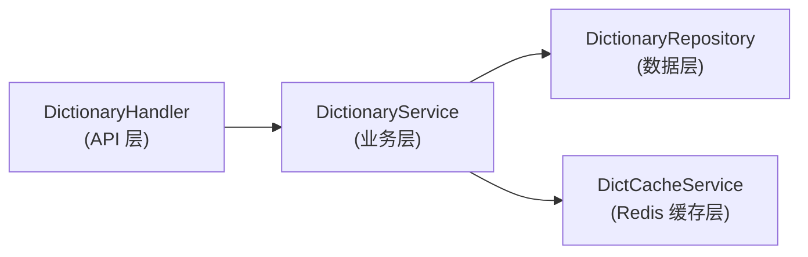

# 项目底层基础技术分析报告

针对 `home-decoration` 后端（Go / Gin / GORM / PostgreSQL / Redis）逐项检查结果如下。

---

## 1. 索引（Index） ✅ 已实现

项目在 GORM Model 层大量使用了 `uniqueIndex` 和 `index` 标签，覆盖所有核心实体。

| 模型 | 索引字段 | 类型 |
|------|---------|------|
| `User` | `PublicID`, `Phone` | uniqueIndex |
| `UserWechatBinding` | `(UserID,AppID)`, `(AppID,OpenID)` | 复合 uniqueIndex |
| `Provider`, `ProviderCase` | `UserID`, `ProviderID` | index |
| `Milestone` | `ProjectID` | uniqueIndex + index |
| `Transaction` | `OrderID` | uniqueIndex |
| `UserFollow` | `(UserID,TargetID,TargetType)` | 复合 uniqueIndex |
| `UserFavorite` | `(UserID,TargetID,TargetType)` | 复合 uniqueIndex |
| `Order` | `OrderNo` | uniqueIndex |
| `SysAdmin` | `Username` | uniqueIndex |
| `SysRole` | `Key` | uniqueIndex |
| `Region` | `Code` | uniqueIndex |
| `DictionaryCategory` | `Code` | uniqueIndex |

> [!TIP]
> 索引覆盖较全面，复合索引用于多条件唯一约束（如关注/收藏防重复）。

---

## 2. 脏读 / 幻读 / 事务隔离 ⚠️ 部分实现

### 事务（Transaction） ✅

项目使用 GORM 的 `DB.Transaction()` 闭包在多个关键业务场景中保证原子性：

| 文件 | 场景 |
|------|------|
| [escrow_service.go](file:///Volumes/tantan/AI_project/home-decoration/server/internal/service/escrow_service.go) | 资金托管账户的支付、确认操作 |
| [user_service.go](file:///Volumes/tantan/AI_project/home-decoration/server/internal/service/user_service.go) | 用户注册、登录时的用户创建+Tinode同步 |
| [project_service.go](file:///Volumes/tantan/AI_project/home-decoration/server/internal/service/project_service.go) | 项目创建伴随阶段/任务 |
| [identity_service.go](file:///Volumes/tantan/AI_project/home-decoration/server/internal/service/identity_service.go) | 身份认证审批（更新申请+服务商+身份）|

### 事务隔离级别 ❌ 未显式设置

> [!WARNING]
> 全项目未找到任何 `IsolationLevel`、`Serializable`、`RepeatableRead` 相关配置。当前依赖 PostgreSQL 默认的 **Read Committed** 级别，在高并发的资金操作（如托管账户）场景中可能出现幻读。
>
> **建议**: 为资金相关事务（escrow）使用 `&sql.TxOptions{Isolation: sql.LevelSerializable}` 或行级锁 `SELECT ... FOR UPDATE`。

---

## 3. Session / Entity ✅ 已实现

### Session 管理

- **JWT + Session ID (sid)**: [user_service.go](file:///Volumes/tantan/AI_project/home-decoration/server/internal/service/user_service.go) 在生成 JWT 时包含 `sid` 字段
- **Session 撤销**: [token_service.go](file:///Volumes/tantan/AI_project/home-decoration/server/internal/service/token_service.go) 的 `RevokeSession()` 可通过 Redis 批量撤销一个会话的所有 token
- **微信 Session**: [wechat_auth_service.go](file:///Volumes/tantan/AI_project/home-decoration/server/internal/service/wechat_auth_service.go) 处理微信的 `code2Session` 流程
- **Token 重放检测**: 使用 Redis 的 `jti` 记录防止 refresh token 重放

### Entity（实体模型）

- 统一使用 GORM Model 定义，约 30+ 实体在 [model.go](file:///Volumes/tantan/AI_project/home-decoration/server/internal/model/model.go) 中
- 使用 `Base` 基础模型（ID + CreatedAt + UpdatedAt）
- 有 `BeforeCreate` 钩子（如 User 自动生成 PublicID）
- 实体关联加载使用 `Preload("Roles")`, `Joins(...)` 等

---

## 4. 线程（Goroutine）同步 ✅ 已实现

### Goroutine 使用

项目使用 `go func()` 启动异步任务：

| 场景 | 文件 |
|------|------|
| 定时任务 (Cron) | `income_cron.go`, `booking_cron.go`, `order_cron.go` |
| Tinode 用户同步 | `user_service.go` (注册/登录后的 best-effort 同步) |
| 身份认证异步回调 | `merchant_apply_handler.go` |
| 微信登录用户同步 | `wechat_auth_service.go` |
| RateLimit 清理 | `rate_limit.go` (每5分钟一次) |

### 同步原语

| 原语 | 使用场景 |
|------|---------|
| `sync.Mutex` | 微信 access token 刷新、PublicID rollout/rollback/health 监控 |
| `sync.RWMutex` | RateLimit 限流器、SMS 服务、敏感词缓存 |
| `sync.Once` | 限流器单例初始化 |
| `defer mu.Unlock()` | ✅ 所有 Lock 均配对 defer Unlock |

> [!WARNING]
> Goroutine 均未使用 `context.WithTimeout` 或 `context.WithCancel`，**缺乏超时控制机制**，可能导致 Goroutine 泄漏。
>
> **建议**: 为异步 goroutine 传入带超时的 context，并在 panic recovery 中加 `defer recover()`（部分已有，但不统一）。

---

## 5. 死锁 ⚠️ 有防范但不完备

- ✅ 所有 `Mutex.Lock()` 均使用 `defer Unlock()`，不会因 panic 导致未释放
- ✅ 未发现嵌套锁（一个 goroutine 中获取多把锁的情况）
- ❌ 数据库层面未使用 `SELECT ... FOR UPDATE` 或分布式锁来防止并发写冲突
- ❌ 资金操作（escrow）缺乏乐观锁（version 字段）或悲观锁

> [!IMPORTANT]
> 建议在 `EscrowAccount` 的余额变更上增加乐观锁（`gorm:"column:version"` + `Where("version = ?", oldVersion)`）或使用 `SELECT ... FOR UPDATE`。

---

## 6. 内存泄漏 ⚠️ 有风险点

### 已有的防护 ✅
- `defer resp.Body.Close()` — HTTP 响应体正确关闭
- `defer db.Close()` — 数据库连接正确关闭
- `defer ticker.Stop()` — 定时器正确停止
- `defer f.Close()` — 文件句柄正确关闭
- `defer recover()` — 部分 goroutine 有 panic 恢复

### 潜在风险 ❌

| 风险 | 位置 | 说明 |
|------|------|------|
| Goroutine 泄漏 | `go func()` 启动的所有 goroutine | 无 context 控制，无法优雅关闭 |
| SMS 内存 map 增长 | `sms_service.go` | `phoneRecords`/`ipRecords` 在内存中无上限，仅靠 `CleanupOldRecords` 清理，高流量下可能积压 |
| RateLimit map 增长 | `rate_limit.go` | `requests map[string][]time.Time` 无容量上限 |
| DB 连接池未配置 | `database.go` | 未设置 `MaxOpenConns`/`MaxIdleConns`/`ConnMaxLifetime`，默认无连接数上限 |

> [!CAUTION]
> **数据库连接池未配置是严重的生产级问题**。在 `InitDB()` 中应添加：
> ```go
> sqlDB, _ := DB.DB()
> sqlDB.SetMaxOpenConns(25)
> sqlDB.SetMaxIdleConns(10)
> sqlDB.SetConnMaxLifetime(5 * time.Minute)
> ```

---

## 7. 数据字典 ✅ 完整实现

项目有完整的数据字典系统，包含三层架构：



- **Model**: [dictionary.go](file:///Volumes/tantan/AI_project/home-decoration/server/internal/model/dictionary.go) — `DictionaryCategory` + `SystemDictionary`
- **Repository**: [dictionary_repository.go](file:///Volumes/tantan/AI_project/home-decoration/server/internal/repository/dictionary_repository.go) — CRUD + 分页 + 去重检查
- **Service**: [dictionary_service.go](file:///Volumes/tantan/AI_project/home-decoration/server/internal/service/dictionary_service.go) — 业务逻辑 + 缓存失效
- **Cache**: [dict_cache_service.go](file:///Volumes/tantan/AI_project/home-decoration/server/internal/service/dict_cache_service.go) — Redis 缓存（`Get`/`Set`/`Invalidate`）

> [!TIP]
> 字典系统支持分类管理、缓存、前端枚举选项获取，设计完善。

---

## 8. 封装 ✅ 已实现

项目遵循清晰的分层架构：

| 层级 | 目录 | 职责 |
|------|------|------|
| Handler | `internal/handler/` | HTTP 请求解析、参数校验、响应格式化 |
| Service | `internal/service/` | 核心业务逻辑 |
| Repository | `internal/repository/` | 数据访问层 |
| Model | `internal/model/` | 数据模型定义 |
| Middleware | `internal/middleware/` | 横切关注点（认证、限流、日志等）|
| Config | `internal/config/` | 配置管理 |
| Utils | `internal/utils/` | 工具函数 |
| Pkg | `pkg/response/` | 统一响应封装 |

封装特征：
- ✅ 统一响应格式 `response.Success()` / `response.Error()` / `response.PageSuccess()`
- ✅ 中间件链分离横切关注点
- ✅ 配置通过 Viper 统一管理
- ✅ Go `interface{}` 用于 SMSProvider 抽象

---

## 9. 消息机制 ✅ 已实现

### 应用内通知 ✅

[notification_service.go](file:///Volumes/tantan/AI_project/home-decoration/server/internal/service/notification_service.go) 提供完整的通知系统：

- **11 种事件通知**：预约支付、接单确认、方案提交/确认/拒绝、订单创建/支付、提现审核、退款等
- **通知管理**：获取列表、未读计数、标记已读、批量标记、删除
- **管理员通知**：`NotifyAdmins()` 向超级管理员批量推送

### 短信（SMS） ✅

- [sms_service.go](file:///Volumes/tantan/AI_project/home-decoration/server/internal/service/sms_service.go) — 频率控制（60秒/次，每IP每天20次）
- [sms_verification.go](file:///Volumes/tantan/AI_project/home-decoration/server/internal/service/sms_verification.go) — 验证码生成+Redis存储+校验
- [sms_provider_aliyun.go](file:///Volumes/tantan/AI_project/home-decoration/server/internal/service/sms_provider_aliyun.go) — 阿里云短信接口对接

### 即时通讯（IM） ✅

- [tencentim/](file:///Volumes/tantan/AI_project/home-decoration/server/internal/utils/tencentim/) — 腾讯云 IM 集成
- [tinode/](file:///Volumes/tantan/AI_project/home-decoration/server/internal/tinode/) — Tinode 开源 IM 集成

### WebSocket ❌

仅在 TODO 注释中提及，尚未实现。当前 IM 依赖第三方服务。

---

## 10. TPS / QPS（限流与性能控制） ⚠️ 部分实现

### 限流（Rate Limiting） ✅

[rate_limit.go](file:///Volumes/tantan/AI_project/home-decoration/server/internal/middleware/rate_limit.go) 实现了基于**滑动窗口算法**的 IP 限流：

| 场景 | 配置 |
|------|------|
| 全局 API | 100 次/分钟 |
| 敏感操作（提现等）| 10 次/分钟 |
| 登录/注册/发码 | 5 次/分钟（防暴力破解）|
| 身份切换 | 5 次/分钟（Redis Incr）|

### 未实现 ❌

| 缺失项 | 说明 |
|--------|------|
| TPS/QPS 监控指标 | 无 Prometheus / metrics 端点 |
| 数据库连接池配置 | 生产代码未设置 MaxOpenConns |
| 请求超时控制 | 未使用 `context.WithTimeout`，无请求级超时 |
| 分布式限流 | 仅本地内存限流，多实例部署时失效 |
| 性能基准测试 | 无 benchmark 测试 |

> [!IMPORTANT]
> 当前限流基于单实例内存 map，**多实例部署时各节点限流独立**，应迁移到 Redis 实现分布式限流。

---

## 总结评分

| 技术项 | 状态 | 评分 | 关键问题 |
|--------|------|------|---------|
| 索引 | ✅ 完善 | ⭐⭐⭐⭐⭐ | — |
| 事务 | ✅ 已用 | ⭐⭐⭐⭐ | 缺乏隔离级别控制 |
| 脏读/幻读防护 | ⚠️ 默认 | ⭐⭐⭐ | 依赖 PG 默认级别，资金场景需加强 |
| Session/Entity | ✅ 完善 | ⭐⭐⭐⭐⭐ | — |
| 线程同步 | ✅ 良好 | ⭐⭐⭐⭐ | Goroutine 缺 context 超时 |
| 死锁防护 | ⚠️ 基本 | ⭐⭐⭐ | 无数据库层面锁策略 |
| 内存泄漏 | ⚠️ 有风险 | ⭐⭐⭐ | 连接池未配置，内存 map 无上限 |
| 数据字典 | ✅ 完整 | ⭐⭐⭐⭐⭐ | — |
| 封装 | ✅ 良好 | ⭐⭐⭐⭐⭐ | 分层清晰 |
| 消息机制 | ✅ 丰富 | ⭐⭐⭐⭐ | WebSocket 未自实现 |
| TPS/QPS | ⚠️ 基本 | ⭐⭐⭐ | 仅本地限流，无监控指标 |
