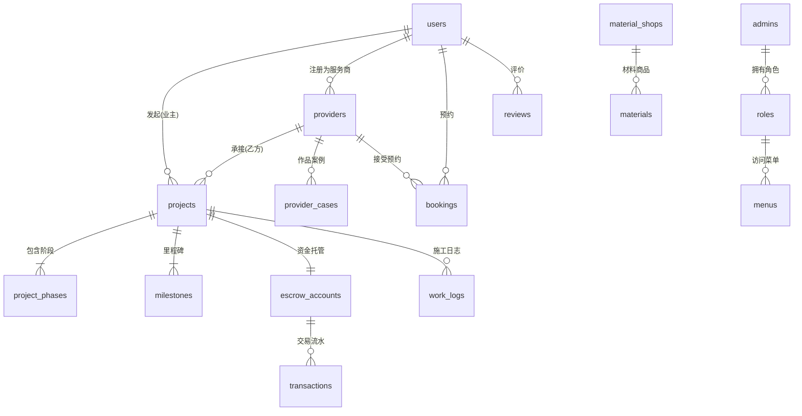

# 装修设计一体化平台 - 技术架构设计总览 (Technical Architecture Overview)

> **文档版本**: v3.1
> **更新日期**: 2025年12月29日
> **包含范围**: 系统架构、技术版本、数据库设计、后端API、前端架构、UI/UX规范
>
> **重要变更**:
> - ✅ 采用混合 React 版本策略（Admin: 18.3.1 / Mobile: 19.2.0）
> - ✅ Mobile 端改为纯原生应用（移除 Web 构建支持）
> - ✅ Docker 配置优化（移除 Mobile Web 服务）

---

## 1. 架构总览 (System Architecture)

### 1.1 技术栈与版本信息 (Tech Stack & Versions)

#### 1.1.1 后端技术栈 (Backend)
- **运行时**: Go 1.21+
- **Web框架**: Gin v1.9.1
- **数据库ORM**: GORM v1.25.5
- **数据库驱动**:
  - PostgreSQL Driver v1.5.4 (gorm.io/driver/postgres)
  - lib/pq v1.10.9
- **认证授权**:
  - JWT v5.2.0 (github.com/golang-jwt/jwt/v5)
  - bcrypt (golang.org/x/crypto v0.17.0)
- **WebSocket**: Gorilla WebSocket v1.5.3
- **配置管理**: Viper v1.18.2
- **缓存**: Redis Client v9.17.2 (github.com/redis/go-redis/v9)
- **架构模式**: RESTful API + WebSocket (实时通信)

#### 1.1.2 数据库 (Database)
- **主数据库**: PostgreSQL 15 (Alpine Docker)
- **缓存层**: Redis 6.2 (Alpine Docker)
- **连接池**: GORM 自动管理
- **数据持久化**: Docker Volume 挂载

#### 1.1.3 管理后台技术栈 (Admin Panel)
- **基础框架**:
  - React 18.3.1
  - TypeScript 5.9.3
  - React Router DOM v7.10.1
- **UI组件库**:
  - Ant Design v5.29.2
  - Ant Design Pro Components v2.8.10
  - Ant Design Icons v6.1.0
- **状态管理**: Zustand v5.0.9
- **工具库**:
  - Axios v1.13.2 (HTTP 客户端)
  - ahooks v3.9.6 (React Hooks 工具集)
  - antd-img-crop v4.27.0 (图片裁剪)
- **即时通讯**:
  - Tencent Cloud Chat v3.6.2
  - Tencent Chat UIKit React v4.5.1
- **构建工具**: Vite v7.2.4
- **代码规范**: ESLint v9.39.1 + TypeScript ESLint v8.46.4

#### 1.1.4 移动端技术栈 (Mobile App)

**重要说明**: 移动端采用 **纯原生应用** 架构，仅支持 iOS/Android 平台。Web 构建已移除。

- **基础框架**:
  - React Native 0.83.0
  - **React 19.2.0** ⚠️ (与 Admin 端不同版本)
  - TypeScript 5.8.3
- **导航路由**:
  - React Navigation Native v7.1.25
  - Native Stack Navigator v7.8.6
  - Bottom Tabs v7.8.12
- **状态管理**: Zustand v5.0.9
- **网络请求**: Axios v1.13.2
- **本地存储**:
  - AsyncStorage v2.2.0
  - React Native Keychain v10.0.0 (安全存储)
- **UI组件**:
  - Lucide React Native v0.562.0 (图标库)
  - React Native SVG v15.15.1
- **功能组件**:
  - React Native Image Picker v8.2.1 (图片选择)
  - React Native Image Crop Picker v0.51.1 (图片裁剪)
  - React Native Camera Kit v16.1.3 (相机)
  - React Native Clipboard v1.16.3 (剪贴板)
  - Community Geolocation v3.4.0 (地理定位)
- **即时通讯**:
  - Tencent Cloud Chat v3.6.2
  - Tencent Chat UIKit RN v1.1.0
- **原生适配**:
  - Safe Area Context v5.6.2 (刘海屏适配)
  - React Native Screens v4.19.0
- **构建工具**:
  - Metro Bundler (React Native 默认)
  - Android Studio (APK/AAB 打包)
  - Xcode (IPA 打包)
  - Babel 7.25.2
- **Node环境**: Node.js >= 20

#### 1.1.5 容器化与部署 (Deployment)
- **容器化**: Docker + Docker Compose
- **基础镜像**:
  - PostgreSQL: `postgres:15-alpine`
  - Redis: `redis:6.2-alpine`
  - Node.js: `node:20-alpine` (Admin 构建)
  - Go: `golang:1.23-alpine` → `alpine:latest` (多阶段构建)
- **反向代理**: Nginx (生产环境)
- **开发环境**: docker-compose.local.yml (DB + Redis + API + Admin)
- **生产环境**: deploy/docker-compose.prod.yml (完整服务栈)
- **端口映射**:
  - 后端API: 8080
  - 管理后台: 5173 (开发) / 80,443 (生产)
  - PostgreSQL: 5432
  - Redis: 6380 (开发) / 6379 (生产)
  - **移动端**: 使用 Metro Bundler (8081) + ADB 反向代理

#### 1.1.6 开发工具链 (Development Tools)
- **版本控制**: Git
- **包管理器**:
  - Go Modules (后端)
  - npm (前端，使用淘宝镜像加速)
- **代码风格**:
  - Go: gofmt + golangci-lint
  - TypeScript/JavaScript: ESLint + Prettier
- **热更新**:
  - 后端: Air (Go 热重载)
  - 前端: Vite HMR
  - 移动端: Metro Fast Refresh

### 1.2 系统架构图 (System Architecture Diagram)

```
┌─────────────────────────────────────────────────────────────┐
│                     客户端层 (Client Layer)                   │
├─────────────────────────────────────────────────────────────┤
│  移动端 App          管理后台            移动端 Web           │
│  React Native       React + AntD        RN Web              │
│  iOS/Android        Vite Build          Vite Build          │
└─────────────────────────────────────────────────────────────┘
                              │
                              ▼
┌─────────────────────────────────────────────────────────────┐
│                     网关层 (Gateway Layer)                    │
├─────────────────────────────────────────────────────────────┤
│              Nginx 反向代理 (计划中)                          │
│       - API 路由: /api/v1/*                                  │
│       - 静态资源: /admin/*, /mobile/*                         │
│       - WebSocket: /api/v1/ws                               │
└─────────────────────────────────────────────────────────────┘
                              │
                              ▼
┌─────────────────────────────────────────────────────────────┐
│                    应用层 (Application Layer)                 │
├─────────────────────────────────────────────────────────────┤
│              Go Backend (Gin Framework)                     │
│  ┌────────────────────────────────────────────────────┐    │
│  │  Middleware: CORS, JWT Auth, Logging, Recovery     │    │
│  ├────────────────────────────────────────────────────┤    │
│  │  HTTP Handler: RESTful API Endpoints               │    │
│  │  WebSocket Handler: Real-time Chat                 │    │
│  ├────────────────────────────────────────────────────┤    │
│  │  Service Layer: Business Logic                     │    │
│  │  - User Service    - Provider Service              │    │
│  │  - Project Service - Escrow Service                │    │
│  │  - Booking Service - RBAC Service                  │    │
│  ├────────────────────────────────────────────────────┤    │
│  │  Repository Layer: Data Access (GORM)              │    │
│  └────────────────────────────────────────────────────┘    │
└─────────────────────────────────────────────────────────────┘
                              │
                              ▼
┌─────────────────────────────────────────────────────────────┐
│                    数据层 (Data Layer)                        │
├─────────────────────────────────────────────────────────────┤
│  PostgreSQL 15        Redis 6.2         文件存储            │
│  主数据存储           缓存/会话          (计划中)            │
│  GORM ORM            go-redis           OSS/S3             │
└─────────────────────────────────────────────────────────────┘
                              │
                              ▼
┌─────────────────────────────────────────────────────────────┐
│                  第三方服务 (External Services)               │
├─────────────────────────────────────────────────────────────┤
│  腾讯云IM            支付网关            地图服务            │
│  (已集成)           (计划中)           (已集成)              │
└─────────────────────────────────────────────────────────────┘
```

### 1.3 服务模块划分 (Service Modules)
目前采用**单体模块化架构**（Modulith），兼顾开发效率与未来微服务拆分便利性：

#### 核心业务模块
- **auth**: 统一认证中心 (JWT, RBAC权限控制)
- **identity**: 多身份切换系统 (一账户多身份、身份切换、审计日志)
- **user**: 用户资料、用户画像、偏好管理
- **provider**: 服务商库 (设计师/装修公司/工长/工人)
- **project**: 项目全生命周期 (里程碑、阶段任务、验收、日志)
- **escrow**: 资金托管与交易系统 (保证金、分期付款)
- **risk**: 风控与审核中心 (服务商认证、项目审计)

#### 支撑服务模块
- **booking**: 预约管理 (用户与服务商的预约)
- **review**: 评价管理 (项目评价、服务商评价)
- **material**: 材料商城管理 (品牌馆、商品)
- **chat**: 即时通讯 (WebSocket + 腾讯云IM)
- **notification**: 通知中心 (系统通知、消息推送)
- **admin**: 后台管理 (RBAC、审计日志、系统配置)

### 1.4 技术选型理由 (Technology Selection Rationale)

#### 1.4.1 后端选型
- **Go + Gin**: 高性能、并发友好、适合IO密集型业务
- **GORM**: 功能完善的ORM，支持PostgreSQL高级特性
- **PostgreSQL**: 支持JSONB、地理位置、事务完整性
- **Redis**: 高性能缓存、会话存储、消息队列

#### 1.4.2 前端选型
- **React 18**: 组件化开发、生态完善、性能优秀
- **TypeScript**: 类型安全、降低维护成本
- **Ant Design**: 企业级UI组件库、开箱即用
- **Vite**: 快速构建、HMR热更新
- **Zustand**: 轻量级状态管理、API简洁

#### 1.4.3 移动端选型
- **React Native**: 跨平台、代码复用率高、原生性能
- **React Native Web**: 一套代码三端运行 (iOS/Android/Web)
- **React Navigation**: 官方推荐导航库、功能完善
- **Keychain**: 安全存储敏感信息 (Token)

### 1.5 项目目录结构 (Directory Structure)

```
home_decoration/
├── server/                      # Go 后端
│   ├── cmd/api/main.go         # 入口文件
│   ├── internal/               # 内部包
│   │   ├── config/             # 配置管理 (Viper)
│   │   ├── handler/            # HTTP 处理器
│   │   ├── service/            # 业务逻辑层
│   │   ├── repository/         # 数据访问层
│   │   ├── model/              # 数据模型
│   │   ├── router/             # 路由定义
│   │   ├── middleware/         # 中间件
│   │   └── ws/                 # WebSocket
│   ├── pkg/                    # 公共工具
│   ├── scripts/                # SQL 脚本
│   ├── migrations/             # 数据库迁移
│   ├── config.yaml             # 配置文件
│   └── go.mod                  # Go 依赖
│
├── admin/                      # 管理后台
│   ├── src/
│   │   ├── pages/              # 页面组件
│   │   ├── components/         # 公共组件
│   │   ├── layouts/            # 布局组件
│   │   ├── services/           # API 服务
│   │   ├── hooks/              # 自定义 Hooks
│   │   ├── router.tsx          # 路由配置
│   │   └── main.tsx            # 入口文件
│   ├── package.json
│   └── vite.config.ts
│
├── mobile/                     # 移动端应用
│   ├── src/
│   │   ├── screens/            # 页面
│   │   ├── components/         # 组件
│   │   ├── navigation/         # 导航配置
│   │   ├── services/           # API 服务
│   │   ├── store/              # Zustand 状态
│   │   ├── types/              # TypeScript 类型
│   │   └── utils/              # 工具函数
│   ├── android/                # Android 原生
│   ├── ios/                    # iOS 原生
│   ├── package.json
│   └── vite.config.ts          # Web 构建配置
│
├── docs/                       # 项目文档
├── deploy/                     # 部署配置
│   ├── Dockerfile.backend      # 后端镜像
│   ├── Dockerfile.node.dev     # 前端开发镜像
│   └── nginx.conf              # Nginx 配置
├── docker-compose.local.yml    # 本地开发
└── docker-compose.yml          # 生产部署
```

---

## 2. 数据库设计 (Database Design)

### 2.1 数据库架构
- **主数据库**: PostgreSQL 15 (ACID事务、JSONB支持、地理位置查询)
- **缓存层**: Redis 6.2 (会话、缓存、消息队列)
- **连接池配置**:
  - MaxIdleConns: 10
  - MaxOpenConns: 100
  - ConnMaxLifetime: 1小时
- **备份策略**: 每日增量备份 + 每周全量备份 (计划中)

### 2.2 核心ER关系


### 2.3 关键表结构摘要
> 完整数据字典请参考 [server/internal/model/model.go](../server/internal/model/model.go)

#### 2.3.1 用户相关 (User Tables)

**users** - 用户表
- `id`: BIGINT, 主键
- `phone`: VARCHAR(20), 唯一索引, 手机号
- `password_hash`: VARCHAR(255), bcrypt加密
- `username`: VARCHAR(50), 用户名
- `avatar`: TEXT, 头像URL
- `user_type`: INT, 用户类型 (1:业主, 2:服务商, 3:工人)
- `status`: INT, 状态 (1:正常, 0:禁用)
- `created_at`, `updated_at`: TIMESTAMP

**providers** - 服务商表
- `id`: BIGINT, 主键
- `user_id`: BIGINT, 外键 -> users.id
- `name`: VARCHAR(100), 服务商名称
- `type`: INT, 类型 (1:设计师, 2:装修公司, 3:工长, 4:工人)
- `category`: VARCHAR(50), 类别
- `bio`: TEXT, 简介
- `location`: VARCHAR(255), 地址
- `latitude`, `longitude`: DECIMAL, 地理坐标
- `rating`: DECIMAL(3,2), 评分
- `verification_status`: INT, 认证状态 (0:未认证, 1:已认证)
- `license_number`: VARCHAR(100), 营业执照号

#### 2.3.2 项目相关 (Project Tables)

**projects** - 项目表
- `id`: BIGINT, 主键
- `user_id`: BIGINT, 业主ID
- `provider_id`: BIGINT, 服务商ID
- `title`: VARCHAR(200), 项目标题
- `address`: VARCHAR(255), 项目地址
- `area`: DECIMAL(10,2), 面积(平米)
- `budget`: DECIMAL(15,2), 预算
- `status`: INT, 状态 (0:待签约, 1:施工中, 2:验收中, 3:已完工, 4:已取消)
- `current_phase`: VARCHAR(50), 当前阶段
- `start_date`, `expected_end_date`: DATE

**project_phases** - 项目阶段表
- `id`: BIGINT, 主键
- `project_id`: BIGINT, 项目ID
- `phase_name`: VARCHAR(100), 阶段名称 (拆除、水电、泥瓦等)
- `status`: INT, 状态 (0:待开始, 1:进行中, 2:已完成)
- `start_date`, `end_date`: DATE
- `progress`: INT, 进度百分比

**milestones** - 里程碑表
- `id`: BIGINT, 主键
- `project_id`: BIGINT, 项目ID
- `title`: VARCHAR(200), 里程碑标题
- `amount`: DECIMAL(15,2), 金额
- `status`: INT, 状态 (0:待验收, 1:已验收, 2:已释放资金)
- `due_date`: DATE, 截止日期

**work_logs** - 施工日志表
- `id`: BIGINT, 主键
- `project_id`: BIGINT, 项目ID
- `worker_id`: BIGINT, 工人ID
- `content`: TEXT, 日志内容
- `photos`: JSONB, 照片数组 ["url1", "url2"]
- `ai_analysis`: JSONB, AI质检结果
- `log_date`: DATE, 日志日期

#### 2.3.3 资金托管 (Escrow Tables)

**escrow_accounts** - 托管账户表
- `id`: BIGINT, 主键
- `project_id`: BIGINT, 项目ID (唯一)
- `total_amount`: DECIMAL(15,2), 总金额
- `frozen_amount`: DECIMAL(15,2), 冻结金额
- `released_amount`: DECIMAL(15,2), 已释放金额
- `available_amount`: DECIMAL(15,2), 可用余额

**transactions** - 交易流水表
- `id`: BIGINT, 主键
- `escrow_account_id`: BIGINT, 托管账户ID
- `type`: INT, 类型 (1:充值, 2:冻结, 3:释放, 4:退款)
- `amount`: DECIMAL(15,2), 金额
- `description`: TEXT, 描述
- `created_at`: TIMESTAMP

#### 2.3.4 其他核心表

**bookings** - 预约表
- `id`, `user_id`, `provider_id`
- `appointment_date`: TIMESTAMP, 预约时间
- `status`: INT, 状态 (0:待确认, 1:已确认, 2:已完成, 3:已取消)

**reviews** - 评价表
- `id`, `user_id`, `provider_id`, `project_id`
- `rating`: INT, 评分 (1-5)
- `comment`: TEXT, 评价内容
- `photos`: JSONB, 照片

**material_shops** - 材料商城表
- `id`, `name`, `category`
- `location`, `rating`
- `featured`: BOOLEAN, 是否精选

**admins** - 管理员表
- `id`, `username`, `password_hash`
- `role_ids`: JSONB, 角色ID数组

**roles** - 角色表
- `id`, `name`, `description`
- `permissions`: JSONB, 权限配置

**menus** - 菜单表
- `id`, `name`, `path`, `icon`
- `parent_id`: BIGINT, 父菜单ID
- `sort_order`: INT, 排序

#### 2.3.5 身份切换相关 (Identity Tables)

**user_identities** - 用户身份表
- `id`: BIGINT, 主键
- `user_id`: BIGINT, 用户ID
- `identity_type`: VARCHAR(32), 身份类型 (owner, provider, worker, admin)
- `identity_ref_id`: BIGINT, 关联ID (providers.id 或 workers.id)
- `status`: INT, 状态 (0:待审核, 1:已激活, 2:已拒绝, 3:已暂停)
- `verified`: BOOLEAN, 是否已验证
- `verified_at`: TIMESTAMP, 验证时间
- `verified_by`: BIGINT, 验证人ID

**identity_applications** - 身份申请表
- `id`: BIGINT, 主键
- `user_id`: BIGINT, 用户ID
- `identity_type`: VARCHAR(32), 申请的身份类型
- `application_data`: JSONB, 申请材料
- `status`: INT, 状态 (0:待审核, 1:已通过, 2:已拒绝)
- `reject_reason`: TEXT, 拒绝原因
- `applied_at`: TIMESTAMP, 申请时间
- `reviewed_at`: TIMESTAMP, 审核时间
- `reviewed_by`: BIGINT, 审核人ID

**identity_audit_logs** - 身份审计日志表
- `id`: BIGINT, 主键
- `user_id`: BIGINT, 用户ID
- `action`: VARCHAR(64), 操作类型 (switch, apply, approve, reject, suspend)
- `from_identity`: VARCHAR(32), 原身份
- `to_identity`: VARCHAR(32), 目标身份
- `ip_address`: VARCHAR(50), IP地址
- `user_agent`: TEXT, User Agent
- `metadata`: JSONB, 额外元数据
- `created_at`: TIMESTAMP, 创建时间

### 2.4 数据库索引策略
- **主键索引**: 所有表的 `id` 字段
- **唯一索引**:
  - `users.phone`
  - `escrow_accounts.project_id`
- **普通索引**:
  - `providers.user_id`, `providers.type`
  - `projects.user_id`, `projects.provider_id`, `projects.status`
  - `transactions.escrow_account_id`
  - 地理位置索引: `providers(latitude, longitude)`
- **JSONB索引**: `work_logs.photos`, `work_logs.ai_analysis` (GIN索引)

---

## 3. 后端设计 (Backend Design)

### 3.1 分层架构 (Layered Architecture)

```
┌────────────────────────────────────────┐
│   Handler Layer (HTTP/WebSocket)       │  接收请求、参数验证、返回响应
│   - 路由注册                            │
│   - 请求解析                            │
│   - 响应格式化                          │
└────────────────────────────────────────┘
                    │
                    ▼
┌────────────────────────────────────────┐
│   Service Layer (Business Logic)       │  核心业务逻辑
│   - 业务规则                            │
│   - 数据处理                            │
│   - 事务管理                            │
└────────────────────────────────────────┘
                    │
                    ▼
┌────────────────────────────────────────┐
│   Repository Layer (Data Access)       │  数据访问抽象
│   - GORM操作                            │
│   - 查询封装                            │
│   - 数据映射                            │
└────────────────────────────────────────┘
                    │
                    ▼
┌────────────────────────────────────────┐
│   Database (PostgreSQL + Redis)        │  数据持久化
└────────────────────────────────────────┘
```

### 3.2 API 规范

#### 3.2.1 RESTful 设计原则
- **Base URL**: `http://api.example.com/api/v1`
- **版本管理**: URL路径版本化 (`/api/v1`, `/api/v2`)
- **HTTP方法**:
  - `GET`: 查询资源
  - `POST`: 创建资源
  - `PUT/PATCH`: 更新资源
  - `DELETE`: 删除资源
- **状态码**:
  - `200 OK`: 成功
  - `201 Created`: 创建成功
  - `400 Bad Request`: 参数错误
  - `401 Unauthorized`: 未认证
  - `403 Forbidden`: 无权限
  - `404 Not Found`: 资源不存在
  - `500 Internal Server Error`: 服务器错误

#### 3.2.2 统一响应格式
```json
{
  "code": 0,
  "message": "OK",
  "data": {
    "id": 123,
    "name": "example"
  }
}
```

错误响应:
```json
{
  "code": 400,
  "message": "参数错误: 手机号格式不正确",
  "data": null
}
```

分页响应:
```json
{
  "code": 0,
  "message": "OK",
  "data": {
    "items": [...],
    "total": 100,
    "page": 1,
    "pageSize": 20
  }
}
```

#### 3.2.3 认证授权
- **JWT Token**: Header `Authorization: Bearer <token>`
- **Token 有效期**: 7天 (可刷新)
- **Token Payload**:
  ```json
  {
    "user_id": 123,
    "username": "张三",
    "user_type": 1,
    "active_role": "owner",
    "identity_ref_id": null,
    "exp": 1704067200
  }
  ```
- **RBAC 权限**: 后台管理使用基于角色的权限控制

#### 3.2.4 核心API端点

**认证相关** (`/api/v1/auth`)
- `POST /auth/register` - 用户注册
- `POST /auth/login` - 用户登录
- `POST /auth/logout` - 退出登录
- `POST /auth/refresh` - 刷新Token
- `GET /auth/profile` - 获取当前用户信息

**用户相关** (`/api/v1/users`)
- `GET /users/:id` - 获取用户详情
- `PUT /users/:id` - 更新用户信息
- `POST /users/:id/avatar` - 上传头像

**服务商相关** (`/api/v1/providers`)
- `GET /providers` - 服务商列表 (支持筛选、排序、分页)
- `GET /providers/:id` - 服务商详情
- `POST /providers` - 创建服务商资料
- `PUT /providers/:id` - 更新服务商信息
- `GET /providers/:id/cases` - 服务商作品案例

**项目相关** (`/api/v1/projects`)
- `GET /projects` - 项目列表
- `GET /projects/:id` - 项目详情
- `POST /projects` - 创建项目
- `PUT /projects/:id` - 更新项目
- `POST /projects/:id/deposit` - 充值到托管账户
- `POST /projects/:id/accept` - 验收节点
- `POST /projects/:id/release` - 释放资金

**预约相关** (`/api/v1/bookings`)
- `POST /bookings` - 创建预约
- `GET /bookings` - 我的预约列表
- `PUT /bookings/:id/confirm` - 确认预约

**评价相关** (`/api/v1/reviews`)
- `POST /reviews` - 提交评价
- `GET /providers/:id/reviews` - 服务商评价列表

**身份切换相关** (`/api/v1/identities`)
- `GET /identities` - 获取用户所有身份
- `GET /identities/current` - 获取当前激活身份
- `POST /identities/switch` - 切换身份 (返回新Token)
- `POST /identities/apply` - 申请新身份

**WebSocket** (`/api/v1/ws`)
- 建立连接: `ws://api.example.com/api/v1/ws?token=<jwt_token>`
- 消息格式:
  ```json
  {
    "type": "message",
    "recipientId": 456,
    "content": "你好",
    "messageType": "text"
  }
  ```

**管理后台** (`/api/v1/admin`)
- `POST /admin/login` - 管理员登录
- `GET /admin/users` - 用户管理
- `GET /admin/providers` - 服务商管理
- `POST /admin/providers/:id/verify` - 服务商认证
- `GET /admin/projects` - 项目管理
- `GET /admin/roles` - 角色管理
- `GET /admin/menus` - 菜单管理

### 3.3 中间件 (Middleware)

1. **CORS中间件**: 跨域资源共享配置
2. **JWT认证中间件**: 验证Token有效性
3. **日志中间件**: 记录请求日志 (Gin Logger)
4. **恢复中间件**: 捕获panic，防止程序崩溃 (Gin Recovery)
5. **限流中间件**: 防止API滥用 (计划中)
6. **权限中间件**: RBAC权限验证 (管理后台)
7. **审计日志中间件**: 记录敏感操作 (管理后台)

### 3.4 核心业务流程

#### 3.4.1 资金托管释放流程
```
1. 业主充值 (POST /projects/:id/deposit)
   └─> 创建transaction(充值) -> 增加total_amount & frozen_amount

2. 施工进度更新
   └─> 工长提交验收申请 -> 项目状态变为"验收中"

3. 业主验收 (POST /projects/:id/accept)
   └─> 验收通过 -> milestone.status = "已验收"

4. 资金释放 (POST /projects/:id/release)
   └─> 创建transaction(释放) -> 扣除frozen_amount -> 增加released_amount
   └─> 服务商账户余额 +amount (计划中)
```

#### 3.4.2 服务商认证流程
```
1. 服务商提交认证资料
   └─> 上传营业执照、身份证等

2. 管理员审核
   └─> 后台审核页面 -> 通过/驳回

3. 通知服务商
   └─> 系统通知 + 短信/邮件 (计划中)
```

#### 3.4.3 WebSocket 聊天流程
```
1. 客户端连接: ws://api/v1/ws?token=<jwt>
2. 服务端验证Token -> 建立连接 -> 注册到Hub
3. 发送消息: {"type": "message", "recipientId": 456, "content": "你好"}
4. Hub转发: 查找recipient连接 -> 推送消息
5. 持久化: 存储到数据库chat表
6. 断线重连: 自动重连 + 拉取离线消息
```

### 3.5 第三方服务集成

- **腾讯云IM**: 即时通讯SDK (已集成)
  - SDK版本: v3.6.2
  - 用途: 文字、图片、语音消息
- **地图服务**: 地理定位、距离计算 (已集成@react-native-community/geolocation)
- **支付网关**: 微信支付、支付宝 (计划中)
- **对象存储**: 腾讯云COS/阿里云OSS (计划中)
- **短信服务**: 验证码、通知短信 (计划中)

---

## 4. 前端架构 (Frontend Architecture)

### 4.1 移动端架构 (React Native)

#### 4.1.1 目录结构
```
mobile/src/
├── screens/              # 页面组件
│   ├── HomeScreen.tsx
│   ├── InspirationScreen.tsx
│   ├── MessageScreen.tsx
│   ├── MySiteScreen.tsx
│   ├── ProfileScreen.tsx
│   ├── ProviderDetails.tsx
│   ├── BookingScreen.tsx
│   ├── ChatRoomScreen.tsx
│   └── ProjectTimelineScreen.tsx
├── components/           # 公共组件
│   ├── ProviderCard.tsx
│   ├── DesignerCard.tsx
│   ├── WorkerCard.tsx
│   ├── MaterialShopCard.tsx
│   └── InfoModal.tsx
├── navigation/           # 导航配置
│   └── AppNavigator.tsx
├── services/             # API服务
│   ├── api.ts
│   ├── WebSocketService.ts
│   ├── TencentIMService.ts
│   └── LocationService.ts
├── store/                # Zustand状态管理
│   ├── authStore.ts
│   ├── providerStore.ts
│   └── chatStore.ts
├── types/                # TypeScript类型
│   ├── provider.ts
│   └── businessFlow.ts
└── utils/                # 工具函数
    └── SecureStorage.ts
```

#### 4.1.2 核心技术点

**路由导航**
- **底部Tab导航**: 首页、灵感、工地、消息、我的
- **Stack导航**: 页面跳转、参数传递
- **Deep Linking**: 支持从外部链接打开特定页面 (计划中)

**状态管理 (Zustand)**
```typescript
// authStore.ts
interface AuthState {
  user: User | null
  token: string | null
  login: (phone: string, password: string) => Promise<void>
  logout: () => void
  isAuthenticated: boolean
}

// providerStore.ts
interface ProviderState {
  providers: Provider[]
  selectedProvider: Provider | null
  fetchProviders: (filters?: Filters) => Promise<void>
  setSelectedProvider: (provider: Provider) => void
}
```

**安全存储**
- **Token存储**: React Native Keychain (加密存储)
- **敏感数据**: 使用AsyncStorage前加密
- **会话管理**: Token过期自动登出

**跨平台适配**
- **iOS/Android原生**: Metro Bundler构建
- **Web端**: Vite + react-native-web
- **响应式设计**: 根据屏幕尺寸自适应
- **安全区域**: SafeAreaView适配刘海屏

**性能优化**
- **图片懒加载**: FlatList + onViewableItemsChanged
- **列表虚拟化**: FlatList (自带虚拟化)
- **代码分割**: React.lazy动态导入 (Web端)
- **缓存策略**: AsyncStorage缓存API响应

#### 4.1.3 核心页面说明

- **HomeScreen**: 浏览服务商卡片、筛选排序、地图视图
- **InspirationScreen**: 设计灵感Feed、图片瀑布流
- **ProviderDetails**: 服务商详情、作品集、评价、预约按钮
- **BookingScreen**: 预约表单、日期时间选择
- **MySiteScreen**: 我的项目列表、施工进度
- **ProjectTimelineScreen**: 项目时间线、里程碑、验收
- **ChatRoomScreen**: 实时聊天、图片/语音消息
- **ProfileScreen**: 个人信息、订单、设置

### 4.2 管理后台架构 (React + Ant Design)

#### 4.2.1 目录结构
```
admin/src/
├── pages/                # 页面组件
│   ├── dashboard/        # 仪表盘
│   ├── users/            # 用户管理
│   ├── providers/        # 服务商管理
│   ├── projects/         # 项目管理
│   ├── materials/        # 材料商城
│   ├── admins/           # 管理员管理
│   ├── permissions/      # 权限管理
│   ├── audits/           # 审计日志
│   └── settings/         # 系统设置
├── components/           # 公共组件
│   ├── PermissionWrapper.tsx
│   └── ProtectedRoute.tsx
├── layouts/              # 布局组件
│   ├── BasicLayout.tsx
│   └── MerchantLayout.tsx
├── services/             # API服务
│   ├── api.ts
│   └── merchantApi.ts
├── hooks/                # 自定义Hooks
│   └── usePermission.ts
├── router.tsx            # 路由配置
└── main.tsx              # 入口文件
```

#### 4.2.2 核心技术点

**权限控制 (RBAC)**
```typescript
// usePermission Hook
const usePermission = (permission: string) => {
  const { user } = useAuthStore()
  return user?.permissions?.includes(permission) ?? false
}

// PermissionWrapper 组件
<PermissionWrapper permission="user:edit">
  <Button>编辑用户</Button>
</PermissionWrapper>
```

**动态菜单**
- 根据用户角色动态生成侧边栏菜单
- 支持多级菜单、图标、徽章
- 菜单项权限控制

**Pro Components**
- **ProTable**: 高级表格 (搜索、筛选、排序、分页)
- **ProForm**: 表单 (验证、联动、布局)
- **ProDescriptions**: 详情展示
- **ProCard**: 卡片容器

**数据流**
```
用户操作 -> 调用API服务 -> Axios请求 -> 后端API
                                      ↓
                               响应数据
                                      ↓
                            更新Zustand状态 -> 组件重新渲染
```

#### 4.2.3 核心页面说明

- **仪表盘**: 数据统计、趋势图表、待办事项
- **用户管理**: 用户列表、详情、禁用/启用
- **服务商管理**: 服务商列表、认证审核、详情编辑
- **项目管理**: 项目列表、地图视图、进度监控
- **材料商城**: 商城列表、品牌管理、商品审核
- **权限管理**: 角色管理、菜单管理、权限分配
- **审计日志**: 操作日志、登录日志、敏感操作记录
- **系统设置**: 全局配置、参数管理

### 4.3 前端通用规范

#### 4.3.1 代码规范
- **命名规范**:
  - 组件: PascalCase (UserList.tsx)
  - 函数/变量: camelCase (getUserData)
  - 常量: UPPER_SNAKE_CASE (API_BASE_URL)
  - 文件夹: kebab-case (user-management)
- **TypeScript**: 严格模式、类型定义、接口优先
- **ESLint**: 代码检查、自动修复
- **Prettier**: 代码格式化 (2空格缩进)

#### 4.3.2 Git提交规范
```
feat: 新功能
fix: 修复bug
docs: 文档更新
style: 代码格式调整
refactor: 重构
perf: 性能优化
test: 测试相关
chore: 构建/工具链
```

#### 4.3.3 组件设计原则
- **单一职责**: 一个组件只做一件事
- **可复用**: 提取公共逻辑为自定义Hook
- **Props类型**: 所有Props必须定义TypeScript接口
- **默认值**: 使用默认参数或defaultProps
- **错误边界**: 关键组件使用ErrorBoundary包裹

---

## 5. UI/UX 设计规范 (Design System)

### 5.1 色彩系统 (Color Palette)

#### 5.1.1 品牌色
- **主色调 (Primary)**: `#1890FF` - 品牌蓝
  - 用途: 主要操作按钮、链接、高亮
- **成功色 (Success)**: `#52C41A` - 安全绿
  - 用途: 成功提示、正常状态、资金释放
- **警告色 (Warning)**: `#FAAD14` - 预警黄
  - 用途: 待办事项、延期提醒、注意事项
- **危险色 (Error)**: `#FF4D4F` - 危险红
  - 用途: 错误提示、删除操作、拒绝审核

#### 5.1.2 中性色
- **文字主色**: `#262626` (rgba(0,0,0,0.85))
- **文字次色**: `#595959` (rgba(0,0,0,0.65))
- **文字辅助色**: `#8C8C8C` (rgba(0,0,0,0.45))
- **禁用色**: `#BFBFBF` (rgba(0,0,0,0.25))
- **边框色**: `#D9D9D9`
- **分割线**: `#F0F0F0`
- **背景色**: `#FAFAFA`
- **白色**: `#FFFFFF`

#### 5.1.3 语义化颜色
- **信息提示**: `#1890FF` (蓝色)
- **链接**: `#1890FF` (蓝色)
- **高评分**: `#FAAD14` (金色) - 用于星级评分
- **施工中**: `#1890FF` (蓝色)
- **已完工**: `#52C41A` (绿色)
- **已取消**: `#8C8C8C` (灰色)

### 5.2 字体排印 (Typography)

#### 5.2.1 字体家族
- **主字体**:
  - iOS: PingFang SC, San Francisco
  - Android: Noto Sans CJK SC, Roboto
  - Web: -apple-system, BlinkMacSystemFont, 'Segoe UI', Roboto

#### 5.2.2 字号体系
- **H1 标题**: 28px / Bold / 行高 40px
- **H2 标题**: 24px / Bold / 行高 32px
- **H3 标题**: 20px / Bold / 行高 28px
- **H4 标题**: 18px / Medium / 行高 26px
- **正文大**: 16px / Regular / 行高 24px
- **正文**: 14px / Regular / 行高 22px
- **辅助文字**: 12px / Regular / 行高 20px
- **小号文字**: 10px / Regular / 行高 16px

### 5.3 间距系统 (Spacing)

基于8px栅格系统:
- **xs**: 4px
- **sm**: 8px
- **md**: 16px
- **lg**: 24px
- **xl**: 32px
- **xxl**: 48px

### 5.4 圆角 (Border Radius)
- **小圆角**: 4px (按钮、输入框)
- **中圆角**: 8px (卡片)
- **大圆角**: 12px (模态框)
- **圆形**: 50% (头像、徽章)

### 5.5 阴影 (Shadow)
```css
/* 卡片阴影 */
box-shadow: 0 2px 8px rgba(0, 0, 0, 0.1);

/* 悬浮阴影 */
box-shadow: 0 4px 16px rgba(0, 0, 0, 0.15);

/* 模态框阴影 */
box-shadow: 0 8px 24px rgba(0, 0, 0, 0.2);
```

### 5.6 核心交互组件

#### 5.6.1 按钮 (Button)
- **主要按钮**: 品牌蓝背景、白色文字、圆角4px
- **次要按钮**: 白色背景、蓝色边框、蓝色文字
- **危险按钮**: 红色背景、白色文字
- **文字按钮**: 透明背景、蓝色文字
- **禁用状态**: 灰色背景、浅灰色文字、不可点击

#### 5.6.2 卡片 (Card)
- **服务商卡片**: 头像、名称、评分、标签、距离
- **项目卡片**: 封面图、标题、进度条、状态徽章
- **材料商卡片**: 商标、名称、分类、精选标识

#### 5.6.3 状态标签 (Tag/Badge)
```
施工中: 蓝色胶囊 | 已完工: 绿色胶囊 | 已取消: 灰色胶囊
待审核: 黄色胶囊 | 已认证: 绿色✓ | 未认证: 灰色
```

#### 5.6.4 表单组件
- **输入框**: 边框1px灰色、聚焦蓝色、圆角4px、高度40px
- **下拉选择**: Ant Design Select、支持搜索
- **日期选择**: 日历弹窗、时间段选择
- **文件上传**: 拖拽上传、图片预览、裁剪

#### 5.6.5 特殊交互

**滑动确认 (Swipe to Confirm)**
- 用途: 资金支付、验收确认等重要操作
- 样式: 滑块从左到右滑动解锁
- 防误触: 必须滑动到100%才能触发

**下拉刷新 (Pull to Refresh)**
- 用途: 移动端列表页刷新
- 动画: 下拉显示加载指示器

**无限滚动 (Infinite Scroll)**
- 用途: 列表分页加载
- 触发: 滚动到底部自动加载下一页

### 5.7 移动端特殊设计

#### 5.7.1 底部Tab栏
- 高度: 56px + SafeArea底部
- 图标: 24x24px
- 文字: 10px
- 选中态: 品牌蓝色 + 图标填充

#### 5.7.2 导航栏
- 高度: 44px + SafeArea顶部
- 返回按钮: 左侧 < 图标
- 标题: 居中、18px Bold
- 操作按钮: 右侧

#### 5.7.3 触摸热区
- 最小点击区域: 44x44px (iOS规范)
- 按钮内边距: 12px上下、24px左右

### 5.8 响应式设计

#### 5.8.1 断点 (Breakpoints)
- **手机**: < 768px
- **平板**: 768px - 1024px
- **桌面**: > 1024px
- **大屏**: > 1440px

#### 5.8.2 栅格系统
- **移动端**: 单列布局
- **平板**: 2列网格
- **桌面**: 3-4列网格
- **管理后台**: Ant Design 24栅格

### 5.9 动画与过渡

- **页面切换**: 300ms ease-in-out
- **模态框弹出**: 200ms cubic-bezier(0.4, 0, 0.2, 1)
- **列表项hover**: 150ms
- **加载动画**: Spin旋转、Skeleton骨架屏
- **微交互**: 点赞、收藏等操作有视觉反馈

---

## 6. 部署与运维 (DevOps)

### 6.1 容器化部署

#### 6.1.1 Docker镜像
- **后端镜像**: 多阶段构建 (builder -> runtime)
  - 构建阶段: golang:1.21-alpine
  - 运行阶段: alpine:latest
  - 镜像大小: ~20MB
- **前端镜像**: nginx:alpine + 静态文件
  - 管理后台: Vite构建产物
  - 移动端Web: Vite构建产物

#### 6.1.2 Docker Compose
- **本地开发**: docker-compose.local.yml
  - 热更新支持 (Volume挂载)
  - 开发工具 (Air, Vite HMR)
- **生产部署**: docker-compose.yml
  - 优化镜像 (多阶段构建)
  - 资源限制 (CPU、内存)
  - 健康检查 (healthcheck)

### 6.2 CI/CD流程 (计划中)

```
代码提交 -> Git Push
    ↓
GitHub Actions / GitLab CI
    ↓
自动化测试 (单元测试、集成测试)
    ↓
构建Docker镜像
    ↓
推送到镜像仓库 (Harbor / Docker Hub)
    ↓
部署到环境 (开发/测试/生产)
    ↓
健康检查 + 通知
```

### 6.3 监控与日志 (计划中)

- **应用监控**: Prometheus + Grafana
- **日志收集**: ELK Stack (Elasticsearch, Logstash, Kibana)
- **链路追踪**: Jaeger / Zipkin
- **告警通知**: 钉钉、企业微信、邮件

### 6.4 备份策略

- **数据库备份**:
  - 增量备份: 每日凌晨2点
  - 全量备份: 每周日凌晨2点
  - 保留周期: 30天
- **文件备份**: 对象存储自动备份 (计划中)

---

## 7. 安全性设计 (Security)

### 7.1 身份认证
- **密码**: bcrypt加密 (cost=12)
- **Token**: JWT (HS256签名)
- **刷新机制**: Refresh Token延长有效期
- **多端登录**: 支持多设备同时登录

### 7.2 数据安全
- **传输加密**: HTTPS (TLS 1.2+)
- **敏感数据**: 加密存储 (用户密码、支付信息)
- **SQL注入**: GORM参数化查询防注入
- **XSS防护**: React自动转义、Content-Security-Policy

### 7.3 API安全
- **CORS**: 白名单域名限制
- **限流**: 防止API滥用 (计划中)
- **签名验证**: 关键接口签名验证 (计划中)
- **敏感操作**: 二次验证 (短信/邮箱验证码)

### 7.4 权限控制
- **RBAC**: 基于角色的访问控制
- **最小权限原则**: 用户只能访问必要资源
- **审计日志**: 记录所有管理员操作

---

## 8. 性能优化 (Performance)

### 8.1 后端优化
- **数据库索引**: 关键字段建立索引
- **连接池**: 复用数据库连接
- **Redis缓存**: 热点数据缓存
- **分页查询**: 避免一次性查询大量数据
- **Goroutine**: 并发处理耗时任务

### 8.2 前端优化
- **代码分割**: 路由级懒加载
- **图片优化**: WebP格式、懒加载、CDN加速
- **Tree Shaking**: 移除未使用代码
- **Gzip压缩**: 服务端开启Gzip
- **缓存策略**: Service Worker (PWA计划中)

### 8.3 移动端优化
- **FlatList虚拟化**: 长列表性能优化
- **图片缓存**: react-native-fast-image
- **Bundle分包**: Metro分包 (计划中)
- **原生模块**: 性能敏感部分使用原生实现

---

## 9. 技术债务与未来规划 (Roadmap)

### 9.1 短期优化 (1-3个月)
- [ ] 完善单元测试覆盖率
- [ ] 集成支付网关 (微信、支付宝)
- [ ] 对象存储集成 (腾讯云COS)
- [ ] 短信验证码服务
- [ ] API限流中间件

### 9.2 中期目标 (3-6个月)
- [ ] CI/CD流水线搭建
- [ ] 监控告警系统
- [ ] 移动端离线缓存
- [ ] PWA支持
- [ ] 国际化(i18n)

### 9.3 长期愿景 (6-12个月)
- [ ] 微服务拆分 (按业务模块)
- [ ] GraphQL API (替代部分RESTful)
- [ ] AI质检系统 (施工日志智能分析)
- [ ] 智能推荐算法 (服务商推荐)
- [ ] 大数据分析平台

---

## 10. 附录 (Appendix)

### 10.1 相关文档
- [产品需求文档 (PRD)](./产品需求文档(PRD).md)
- [开发与操作手册](./开发与操作手册.md)
- [RBAC权限体系管理](./RBAC权限体系管理.md)
- [业务流程文档](./业务流程规范.md)
- [本地运行](../documentation/02-快速开始/本地运行.md)

### 10.2 技术栈版本总结

| 技术栈 | 版本 | 说明 |
|--------|------|------|
| **后端** |
| Go | 1.21+ | 编程语言 |
| Gin | 1.9.1 | Web框架 |
| GORM | 1.25.5 | ORM |
| PostgreSQL Driver | 1.5.4 | 数据库驱动 |
| JWT | 5.2.0 | 身份认证 |
| Gorilla WebSocket | 1.5.3 | WebSocket |
| Viper | 1.18.2 | 配置管理 |
| Redis Client | 9.17.2 | 缓存客户端 |
| **数据库** |
| PostgreSQL | 15 (Alpine) | 主数据库 |
| Redis | 6.2 (Alpine) | 缓存/队列 |
| **管理后台** |
| React | 18.3.1 | UI框架 |
| TypeScript | 5.9.3 | 类型系统 |
| Ant Design | 5.29.2 | UI组件库 |
| ProComponents | 2.8.10 | 高级组件 |
| React Router | 7.10.1 | 路由 |
| Zustand | 5.0.9 | 状态管理 |
| Axios | 1.13.2 | HTTP客户端 |
| Vite | 7.2.4 | 构建工具 |
| **移动端** |
| React Native | 0.83.0 | 移动框架 |
| React | 18.3.1 | UI框架 |
| TypeScript | 5.8.3 | 类型系统 |
| React Navigation | 7.x | 导航库 |
| Zustand | 5.0.9 | 状态管理 |
| React Native Web | 0.21.2 | Web支持 |
| Keychain | 10.0.0 | 安全存储 |
| AsyncStorage | 2.2.0 | 本地存储 |
| **第三方服务** |
| Tencent Cloud Chat | 3.6.2 | 即时通讯 |
| Geolocation | 3.4.0 | 地理定位 |

### 10.3 端口分配

| 服务 | 端口 | 说明 |
|------|------|------|
| 后端API | 8080 | Go Gin服务 |
| 管理后台 | 5173 | Vite Dev Server |
| 移动端Web | 5174 | Vite Dev Server |
| PostgreSQL | 5432 | 数据库 |
| Redis | 6380 | 缓存服务 (外部访问) |
| Redis内部 | 6379 | 容器内部端口 |

### 10.4 环境变量配置

**后端环境变量** (server/.env)
```bash
APP_ENV=local
DATABASE_HOST=localhost
DATABASE_PORT=5432
DATABASE_USER=postgres
DATABASE_PASSWORD=your_password
DATABASE_DBNAME=home_decoration
DATABASE_SSLMODE=disable
REDIS_HOST=localhost
REDIS_PORT=6379
JWT_SECRET=your_jwt_secret_key
```

**前端环境变量** (admin/.env, mobile/.env)
```bash
VITE_API_URL=http://localhost:8080/api/v1
VITE_WS_URL=ws://localhost:8080/api/v1/ws
VITE_IM_APPID=your_tencent_im_appid
```

---

**文档维护**: 此文档应随项目演进持续更新。每次技术栈升级或架构调整后，请及时同步更新本文档。

**最后更新**: 2026年1月26日
**维护者**: 开发团队
**更新内容**: 添加多身份切换系统 (Phase 6)
