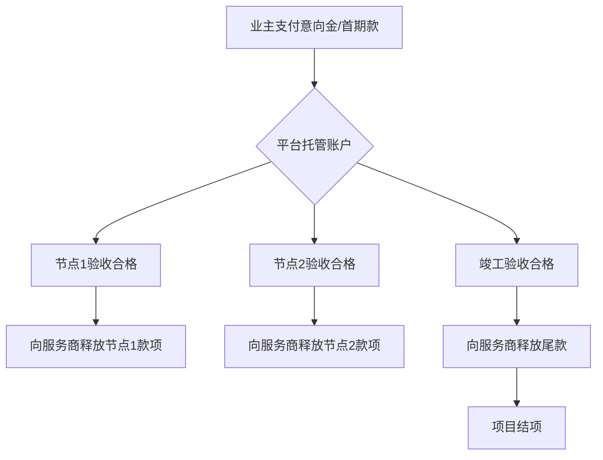
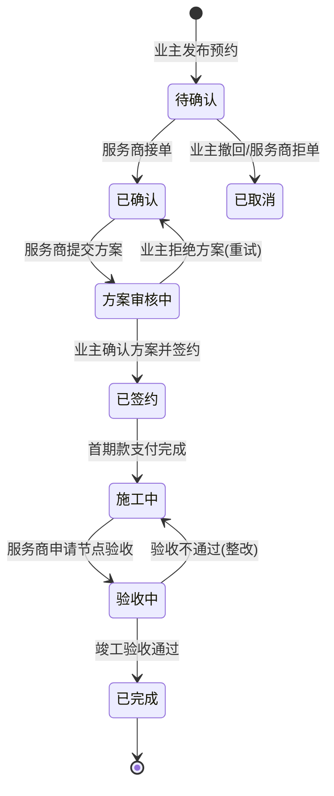

# 业务流程

**最后更新**: 2026-01-25

本文档详细描述了装修设计一体化平台的核心业务流程、资金托管机制以及项目状态机转换规则，旨在帮助开发团队理解业务闭环。

---

## 核心业务流程

平台的业务全链路分为四个主要阶段：**需求发布与预约**、**方案匹配与签约**、**项目执行与施工**、**竣工验收与结算**。

### 1. 项目发布与预约
业主在 App 端发布装修需求，并选择心仪的服务商（设计师/工长）。
- **意向金支付**: 用户提交预约（Booking）时需支付小额意向金（默认 99 元），作为诚意担保。
- **状态**: 预约进入 `pending` 状态，通知服务商。

### 2. 服务商匹配与方案提案
服务商响应预约并提供初步方案。
- **接单**: 服务商确认预约，状态转为 `confirmed`。
- **方案提交**: 服务商上传初步设计方案或报价单（Proposal），并设置设计费。
- **方案决策**: 业主查看方案，可选择“接受”或“拒绝”（拒绝可重试或取消）。

### 3. 合同签署
方案确认后，系统进入签约阶段。
- **合同生成**: 系统根据方案内容自动生成电子合同。
- **电子签名**: 业主与服务商在线完成实名认证与电子签名。
- **技术约束**: 签署后的合同存入资金托管系统，作为后续支付和维权的依据。

### 4. 施工管理与节点验收
项目正式进入施工阶段，采用里程碑式管理。
- **里程碑划分**: 通常分为开工、水电、木瓦、油漆、竣工五个节点。
- **节点汇报**: 服务商每个节点完成后上传施工照片和进度说明。
- **验收申请**: 服务商发起节点验收申请。

### 5. 资金结算
基于“担保交易”模式，保障双方利益。
- **分期放款**: 业主对节点验收合格后，平台将该阶段对应的托管资金结算给服务商。
- **尾款留存**: 竣工验收后留存部分质保金，待质保期满或确认无误后释放。

---

## 资金托管流程

平台采用类似“支付宝”的担保交易模式，资金通过平台托管，根据项目进度分期释放。

**托管规则**:
1. **意向金抵扣**: 意向金在支付首笔大额款项（如设计费或首期款）时自动抵扣。
2. **文件保护**: 施工图纸、详细合同等敏感附件仅在相关账单标记为“已支付”后才开放下载。
3. **退款约束**: 若发生纠纷，由平台介入根据施工进度和合同条款判定退款比例。

---

## 项目状态流转

项目从发布到结项的状态流转逻辑如下：

### 状态流转图

---

## 状态说明

### 预约/项目状态 (Project/Booking Status)

| 状态 | 说明 | 下一步动作 |
| :--- | :--- | :--- |
| `pending` (待确认) | 业主已下单并支付意向金 | 服务商接单或拒单 |
| `confirmed` (已确认) | 服务商已接单 | 服务商提交方案 (Proposal) |
| `in_progress` (进行中) | 方案已确认，项目正在执行或施工 | 节点验收 |
| `completed` (已完成) | 竣工验收通过，资金结算完毕 | 评价与售后 |
| `cancelled` (已取消) | 用户主动取消或超时未响应 | - |

### 订单状态 (Order Status)

| 状态 | 说明 |
| :--- | :--- |
| `pending_payment` | 账单已生成，等待业主支付到托管账户 |
| `paid` | 业主已支付，资金进入托管状态 |
| `settled` | 节点验收通过，资金已划拨给服务商 |
| `refunded` | 发生退款，资金退还给业主 |

---

## 异常处理流程

1. **方案多次拒绝**: 若业主连续拒绝方案超过 3 次，系统将提醒管理员介入或建议解除预约。
2. **施工延期**: 若服务商未能在计划时间内完成节点，业主可发起投诉，平台将冻结后续资金放款。
3. **服务商超时**: 服务商在 48 小时内未响应预约，意向金自动全额退还给业主。
