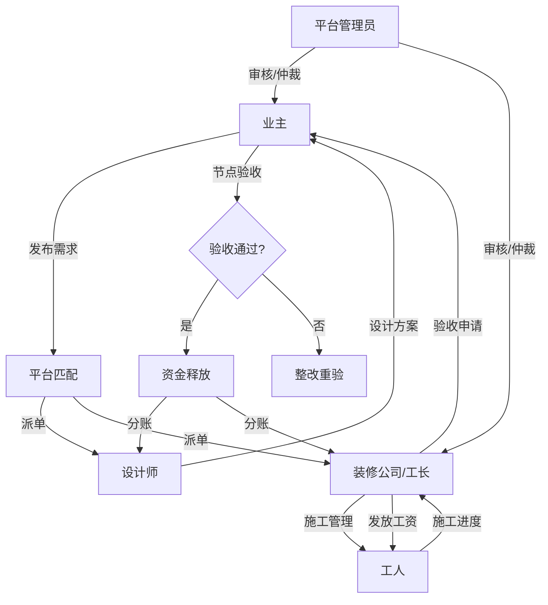

# 用户角色

**最后更新**: 2026-01-25

本文档定义了平台中的各类用户角色、其对应的业务职责以及权限范围，是系统权限设计与业务流程流转的基础。

## 1. 角色总览

平台用户主要分为三大类：**需求方（业主）**、**服务方（商户/专业人员）**和**管理方（平台内部）**。

### 1.1 需求方与服务方角色
| 角色 | 类别 | 说明 | 主要功能 |
|------|------|------|----------|
| **业主** | 需求方 | 装修需求的发起者与资金提供方 | 发布项目、选择服务商、资金托管、节点验收、评价 |
| **设计师** | 服务方 | 提供空间规划与美学方案的专业人员 | 作品展示、接单量房、方案设计、施工交底 |
| **装修公司** | 服务方 | 提供全包/半包服务的企业实体 | 获客转化、团队管理、物料清单管理、项目总控 |
| **工长** | 服务方 | 施工现场的直接负责人与协调者 | 任务领取、工人调度、施工进度上报、质量检查 |
| **工人** | 服务方 | 一线施工的产业工人（水电、泥木等） | 接活施工、进场打卡、完工上报、工资领取 |
| **建材商** | 服务方 | 装修材料与家居产品的供应方 | 商品入驻、LBS地图引流、核销优惠券 |

### 1.2 内部管理角色 (RBAC)
| 角色 Key | 名称 | 说明 | 核心职责 |
|---|---|---|---|
| `super_admin` | 超级管理员 | 系统最高权限持有者 | 系统配置、全模块监控、权限分配 |
| `product_manager` | 产品经理 | 业务功能配置人员 | 字典配置、功能参数调整、项目概览 |
| `operations` | 运营专员 | 平台日常运行维护人员 | 商户入驻审核、内容审核、用户争议初步处理 |
| `finance` | 财务 | 资金流转监控人员 | 托管资金监管、交易审批、财务报表 |
| `risk` | 风控 | 风险控制与仲裁人员 | 异常交易拦截、争议仲裁裁决、信用评分管理 |

---

## 2. 权限矩阵

以下为各核心业务模块在不同角色间的权限分布：

| 功能模块 | 业主 | 设计师 | 工长 | 工人 | 装修公司 | 平台管理 |
|----------|------|--------|------|------|----------|----------|
| **项目发布** | ✅ 拥有 | ❌ | ❌ | ❌ | ❌ | ✅ 协助 |
| **接单/竞标** | ❌ | ✅ 设计 | ✅ 施工 | ✅ 零活 | ✅ 整装 | ✅ 监控 |
| **合同签署** | ✅ 主体 | ✅ 参与 | ✅ 参与 | ❌ | ✅ 主体 | ✅ 见证 |
| **资金托管** | ✅ 存入 | ❌ | ❌ | ❌ | ❌ | ✅ 监管 |
| **进度查看** | ✅ 全部 | ✅ 关联 | ✅ 关联 | ✅ 本人 | ✅ 全部 | ✅ 全部 |
| **施工打卡** | ❌ | ❌ | ✅ 监督 | ✅ 执行 | ❌ | ❌ |
| **节点验收** | ✅ 确认 | ✅ 协同 | ✅ 申请 | ❌ | ✅ 申请 | ✅ 仲裁 |
| **分期放款** | ✅ 触发 | ✅ 接收 | ✅ 接收 | ✅ 接收 | ✅ 接收 | ✅ 审计 |
| **评价管理** | ✅ 发起 | ✅ 查看 | ✅ 查看 | ✅ 查看 | ✅ 查看 | ✅ 审核 |

---

## 3. RBAC 权限模型

平台采用标准的 **RBAC (Role-Based Access Control)** 模型进行权限控制，确保系统安全与灵活。

### 3.1 核心逻辑
- **用户 (User)**: 登录系统的实体（管理员、商户、业主等）。
- **角色 (Role)**: 权限的集合（如：运营专员、设计师）。
- **权限点 (Permission)**: 具体的动作标识，格式为 `{module}:{resource}:{action}`。

### 3.2 关系链条
```
[用户] --(拥有)--> [角色] --(关联)--> [菜单/权限点]
```
- 一个用户可以被分配多个角色。
- 角色决定了用户在后台能看到的菜单以及能操作的按钮（如“删除项目”、“审批提现”）。

---

## 4. 角色关系与交互图

各角色在项目生命周期中的协作关系如下：



### 4.1 核心关系说明
1.  **强监管关系**：平台管理员对所有服务商（设计师、公司、工长）具有审核和处罚权限。
2.  **资金托管关系**：业主支付的资金由平台托管，只有在业主或管理员（仲裁后）确认后，才会释放给服务商。
3.  **层级协作关系**：装修公司或工长作为总控方，向下管理工人的具体施工任务，向上对业主负责。
