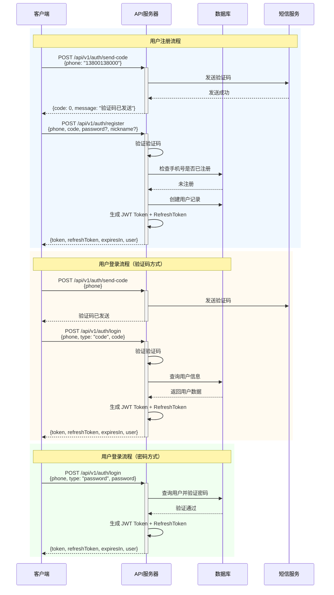
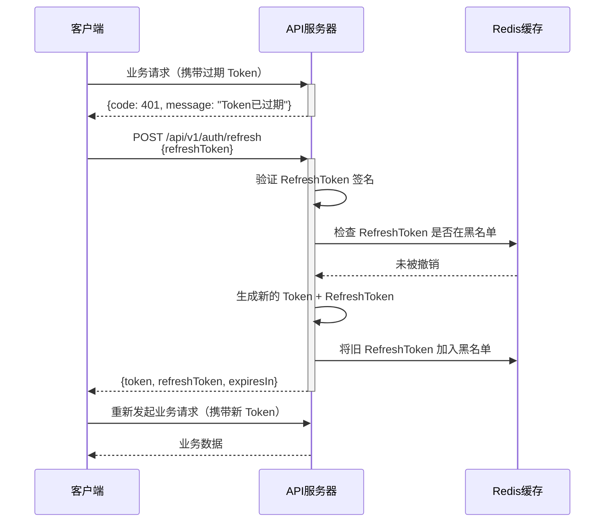
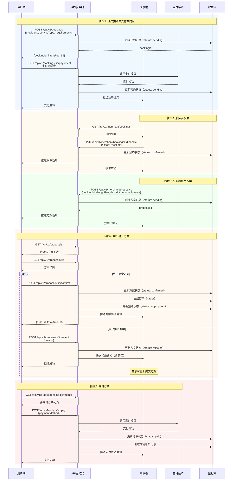
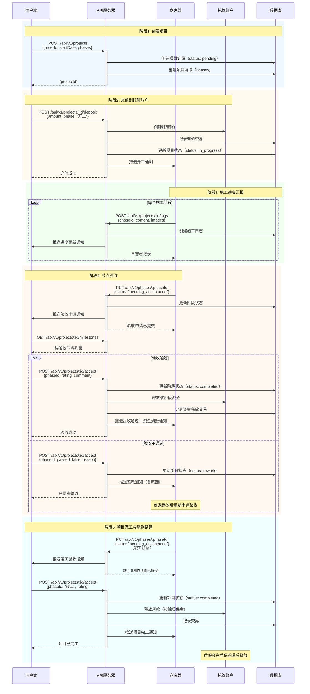
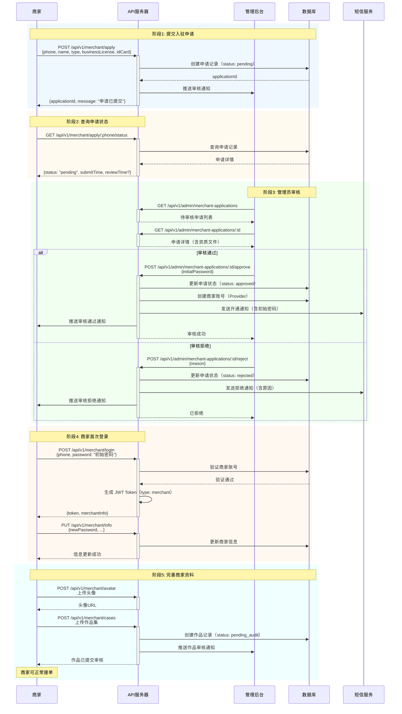

# 业务流程图

**最后更新**: 2026-01-25

本文档使用 Mermaid 图表展示装修设计一体化平台的核心业务流程，包括用户认证、预约到订单、项目进度管理以及商家入驻等关键业务场景。每个流程图标注了相关的 API 端点，便于开发人员理解系统交互逻辑。

---

## 1. 用户认证流程

用户认证流程涵盖注册、登录（验证码/密码）、Token 刷新以及微信小程序登录等场景。

### 1.1 注册与登录流程



### 1.2 Token 刷新流程



### 1.3 微信小程序登录流程

```mermaid
sequenceDiagram
    participant Mini as 小程序
    participant API as API服务器
    participant WX as 微信服务器
    participant DB as 数据库

    Mini->>Mini: wx.login() 获取 code
    Mini->>+API: POST /api/v1/auth/wechat/mini/login<br/>{code}
    API->>+WX: 请求 openid 和 session_key
    WX-->>-API: {openid, session_key}
    
    API->>DB: 根据 openid 查询用户
    
    alt 用户已绑定手机号
        DB-->>API: 返回用户信息
        API->>API: 生成 JWT Token
        API-->>-Mini: {token, user}
    else 用户未绑定手机号
        DB-->>API: 用户不存在
        API-->>-Mini: {needBindPhone: true, tempToken}
        
        Mini->>Mini: 引导用户授权手机号
        Mini->>+API: POST /api/v1/auth/wechat/mini/bind-phone<br/>{tempToken, encryptedData, iv}
        API->>WX: 解密手机号
        WX-->>API: 手机号明文
        API->>DB: 创建/绑定用户
        API->>API: 生成正式 Token
        API-->>-Mini: {token, user}
    end
```

---

## 2. 预约到订单流程

从用户发起预约、支付意向金，到服务商提交方案、用户确认方案并生成订单的完整流程。



**关键状态转换**:
- 预约状态: `pending` → `confirmed` → `in_progress` → `completed` / `cancelled`
- 方案状态: `pending` → `confirmed` / `rejected`
- 订单状态: `pending_payment` → `paid` → `settled` / `refunded`

---

## 3. 项目进度流程

项目从启动、施工、节点验收到资金释放的完整生命周期管理。



**关键 API 端点**:
- `POST /api/v1/projects` - 创建项目
- `POST /api/v1/projects/:id/deposit` - 充值到托管账户
- `POST /api/v1/projects/:id/logs` - 创建施工日志
- `GET /api/v1/projects/:id/milestones` - 获取项目里程碑
- `POST /api/v1/projects/:id/accept` - 节点验收
- `POST /api/v1/projects/:id/release` - 释放资金

---

## 4. 商家入驻流程

服务商（设计师/装修公司/工长）申请入驻平台的审核流程。



**关键状态转换**:
- 申请状态: `pending` → `approved` / `rejected`
- 商家状态: `inactive` → `active` / `suspended`
- 作品审核: `pending_audit` → `approved` / `rejected`

**关键 API 端点**:
- `POST /api/v1/merchant/apply` - 提交入驻申请
- `GET /api/v1/merchant/apply/:phone/status` - 查询申请状态
- `POST /api/v1/merchant/apply/:id/resubmit` - 重新提交申请（被拒后）
- `GET /api/v1/admin/merchant-applications` - 管理员查看申请列表
- `POST /api/v1/admin/merchant-applications/:id/approve` - 审核通过
- `POST /api/v1/admin/merchant-applications/:id/reject` - 审核拒绝
- `POST /api/v1/merchant/login` - 商家登录

---

## 流程图使用说明

### Mermaid 语法
本文档使用 Mermaid 的 `sequenceDiagram` 语法绘制时序图，支持在 GitHub、GitLab、VS Code（需安装插件）等平台直接渲染。

### 图例说明
- **矩形框（rect）**: 表示业务阶段或逻辑分组
- **实线箭头（->>）**: 同步请求
- **虚线箭头（-->>）**: 响应返回
- **alt/else**: 条件分支（如审核通过/拒绝）
- **loop**: 循环操作（如多次施工日志）

### 在线预览
如需在线预览或编辑流程图，可使用以下工具：
- [Mermaid Live Editor](https://mermaid.live/)
- VS Code 插件: `Markdown Preview Mermaid Support`

---

## 相关文档
- [业务流程说明](../../03-产品设计/业务流程.md) - 业务规则与状态机详解
- [认证模块 API](./认证模块.md) - 认证接口详细文档
- [预约模块 API](./预约模块.md) - 预约相关接口
- [项目模块 API](./项目模块.md) - 项目管理接口
- [商家端 API](./商家端.md) - 商家端接口文档

---

**维护说明**: 当业务流程或 API 端点发生变更时，请同步更新本文档中的流程图和端点标注。
