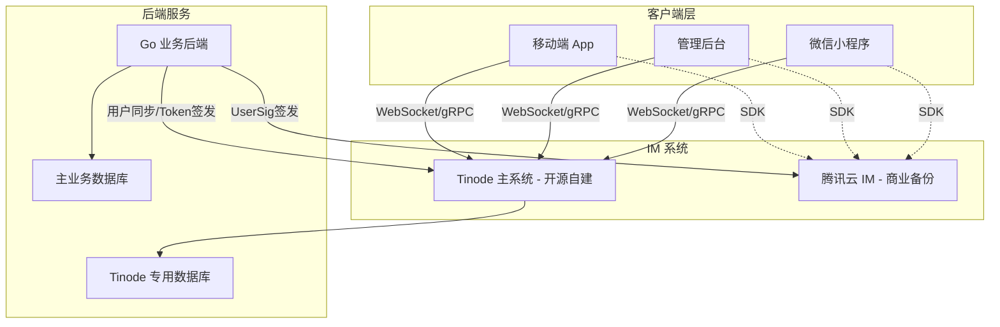

# IM 系统架构说明

**最后更新**: 2026-01-25

## 架构概览

本平台即时通讯（IM）系统采用双轨并行架构，以 **Tinode** 开源系统作为主通讯系统，同时保留 **腾讯云 IM** 作为高可用备份及平滑迁移保障。

### 架构图

## 选型原因

### 1. 为什么选择 Tinode (主系统)
*   **自主可控与数据主权**: 平台涉及 **Escrow（托管支付）** 系统，聊天记录是交易纠纷的重要证据。使用 Tinode 可确保数据完全存储在自有服务器中，满足合规与取证需求。
*   **成本大幅降低**: 相比商业 IM 服务按 DAU 计费的方式，自建 Tinode 系统预计每年可节省 85% 以上的通讯费用（从约 ¥20,000/年 降至 ¥3,000/年 运维成本）。
*   **技术栈匹配**: Tinode 采用 Go 语言实现，与现有后端技术栈高度契合，便于深度定制与统一运维。
*   **功能完整**: 支持 P2P 聊天、群聊、离线消息、已读回执及文件传输，满足当前业务需求。

### 2. 为什么保留腾讯云 IM (备份系统)
*   **高可用性保障**: 作为商业级服务，腾讯云 IM 提供 99.9% 的 SLA，在自建系统出现极端故障时可实现分钟级切流。
*   **平滑迁移策略**: 在从旧系统向 Tinode 迁移的过程中，利用腾讯云 IM 作为缓冲，降低风险。
*   **多端兼容性**: 腾讯云 IM 的 SDK 覆盖更广（特别是微信小程序原生支持较好），可作为特定端的备选方案。

## 迁移状态

当前迁移进度: **85%**

### 已完成
*   **核心链路**: 用户 ID 映射机制（XTEA 加密）、Token 鉴权逻辑。
*   **消息类型**: 文本消息、图片消息、语音消息。
*   **移动端集成**: React Native 端 TinodeService 逻辑已完成 90%。
*   **后端同步**: 用户注册/资料更新的自动同步 Hook。

### 进行中
*   **微信小程序**: 正在实现 Taro 端的 Tinode 适配层。
*   **管理后台**: Admin 端的 TUIKit 替换为自定义 Tinode 界面组件。
*   **历史数据**: 正在验证 `chat_messages` 到 Tinode 数据库的批量迁移脚本。

## 技术架构细节

### 用户认证与 ID 映射
1.  **ID 转换**: 系统不直接向 Tinode 暴露主库 UserID，而是通过 **XTEA** 加密算法将 `uint64` 转换为加密 UID，再编码为 `usr...` 字符串。
2.  **鉴权**: 后端签发基于 **HMAC-SHA256** 的 Token，Tinode 服务器验证该 Token 实现无缝登录。

### 存储策略
*   **双库架构**: 业务数据存储在 `home_decoration` 库，聊天数据存储在独立的 `tinode` 库。
*   **解耦**: 聊天数据的变更不影响业务库性能，且支持独立备份与扩容。

### 客户端路由切换
前端通过 `VITE_IM_PROVIDER` 环境变量或后端配置下发，动态决定实例化的 Service 层（`TinodeService` 或 `TencentIMService`），实现业务代码与底层通讯系统的解耦。
